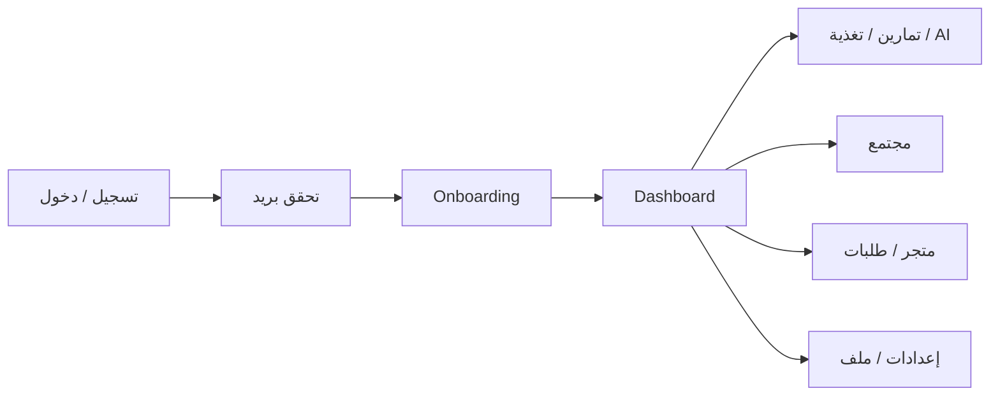

# Taqwin — User (المستخدم)

> توثيق كل ما يخص **حساب المستخدم** في Taqwin: الهوية، المصادقة، الملف الشخصي، الإعدادات، والرحلة من التسجيل حتى استخدام المنصة.  
> لا يشمل هذا الملف: إدارة الصالة (gym owner)، أو لوحة المدرب كمزوّد خدمة — إلا حيث تلمس بيانات المستخدم نفسه.

---

## 1. نظرة عامة

| العنصر | التفاصيل |
|--------|----------|
| **الدور الافتراضي** | `athlete` (متدرب) |
| **أدوار أخرى** | `trainer`، `gym` — نفس جدول `User` مع حقول إضافية في `Profile` |
| **قاعدة البيانات** | PostgreSQL عبر Prisma (`users`, `profiles`, `user_settings`) |
| **المصادقة** | JWT في `Authorization: Bearer` + جلسة في المتصفح (`taqwin_token`, `taqwin_user`) |
| **اللغة** | `UserSettings.language`: `en` \| `ar` |

```text
تسجيل / دخول → تحقق بريد (اختياري) → اختيار دور → Onboarding → Dashboard حسب الدور
```

---

## 2. نموذج البيانات (Prisma)

### 2.1 `User` — `users`

| الحقل | الوصف |
|-------|--------|
| `id` | UUID |
| `email` | فريد، معرّف الدخول الأساسي |
| `passwordHash` | اختياري (Google OAuth بدون كلمة مرور) |
| `googleId` | فريد، ربط Google |
| `role` | `athlete` \| `trainer` \| `gym` |
| `emailVerifiedAt` | بعد OTP البريد |
| `verificationCode` / `verificationCodeExpiry` | تفعيل الحساب |
| `passwordResetToken` / `passwordResetExpiry` | استعادة كلمة المرور |
| `pendingEmail` + أكواد التغيير | تغيير البريد بخطوتين |
| `twoFactorEnabled` / `twoFactorSecret` | TOTP 2FA |
| `phone` / `phoneVerifiedAt` | هاتف + OTP SMS (استعادة كلمة المرور) |

**علاقات المستخدم (ملخص):**

- `profile` — ملف شخصي واحد
- `settings` — تفضيلات `UserSettings`
- `foodLogs`, `exerciseLogs`, `workoutLogs` — نشاط يومي
- `orders` — طلبات المتجر
- `athleteBookings` / `trainerBookings` — حجوزات المدرب
- `gymMemberships`, `gymCheckIns` — عضوية ودخول صالات
- `community*` — منشورات، متابعين، رسائل، قصص، مجموعات
- `notifications`, `supportTickets`

الملف: `backend-node/prisma/schema.prisma` (من سطر `model User`).

### 2.2 `Profile` — `profiles`

حقول مشتركة لكل الأدوار:

| الحقل | الاستخدام |
|-------|-----------|
| `displayName`, `avatarUrl`, `coverUrl` | العرض في الواجهة والمجتمع |
| `dateOfBirth`, `gender`, `height`, `weight` | تخصيص التغذية والـ AI Coach |
| `fitnessGoal`, `fitnessLevel`, `medicalNotes` | أهداف ولياقة |
| `onboardingData` | JSON — إجابات الـ onboarding والاستبيانات |

حقول حسب الدور:

| الدور | حقول إضافية |
|-------|-------------|
| **trainer** | `bio`, `specialties`, `yearsExperience` |
| **gym** | `businessName`, `businessAddress`, `businessPhone`, `websiteUrl` |

### 2.3 `UserSettings` — `user_settings`

| الحقل | القيم / المعنى |
|-------|----------------|
| `language` | `en` \| `ar` |
| `theme` | `light` \| `dark` |
| `notifyWorkoutReminders` | تذكير تمرين |
| `notifyAiSuggestions` | اقتراحات AI |
| `notifyPromotional` | عروض |
| `shareWithTrainers` | مشاركة بيانات مع المدرب |
| `publicProfile` | ملف عام في المجتمع |
| `unitSystem` | `metric` \| `imperial` |
| `timezone` | IANA timezone |

---

## 3. API — حساب المستخدم فقط

كل المسارات تحتاج `Authorization: Bearer <token>` ما لم يُذكر خلاف ذلك.

### 3.1 المصادقة — `/api/auth`

| Method | Path | الوصف |
|--------|------|--------|
| POST | `/check-email` | هل البريد متاح للتسجيل |
| POST | `/register` | تسجيل + إرسال OTP |
| POST | `/login` | دخول (قد يطلب 2FA أو تحقق بريد) |
| POST | `/verify-email` | تأكيد OTP |
| POST | `/resend-verification` | إعادة إرسال OTP |
| GET | `/me` | المستخدم الحالي + profile |
| POST | `/signup-role` | تعيين الدور بعد Google |
| POST | `/set-initial-password` | كلمة مرور أول مرة |
| POST | `/2fa/verify` | إكمال دخول بـ TOTP |
| POST | `/verify-password` | التحقق من كلمة المرور الحالية |
| POST | `/change-password` | تغيير كلمة المرور |
| POST | `/forgot-password` | استعادة (بريد أو SMS) |
| POST | `/reset-password` | إعادة تعيين بكلمة المرور |
| GET | `/google` | بدء OAuth |
| GET | `/google/callback` | رجوع Google |

الملف: `backend-node/src/routes/auth.js`  
المنطق المساعد: `middleware/auth.js`, `config/passport.js`

### 3.2 الملف الشخصي — `/api/profile`

| Method | Path | الوصف |
|--------|------|--------|
| GET | `/` | ملفي الشخصي (يُنشأ تلقائياً إن لم يوجد) |
| PATCH | `/` | تحديث الحقول المسموحة فقط |

الحقول المسموحة في PATCH:  
`displayName`, `avatarUrl`, `coverUrl`, `dateOfBirth`, `gender`, `height`, `weight`, `fitnessGoal`, `fitnessLevel`, `medicalNotes`, `bio`, `specialties`, `yearsExperience`, `businessName`, `businessAddress`, `businessPhone`, `websiteUrl`, `onboardingData`

الملف: `backend-node/src/routes/profile.js`  
المساعد: `backend-node/src/lib/profile.js`

### 3.3 الإعدادات — `/api/settings`

| Method | Path | الوصف |
|--------|------|--------|
| GET | `/` | إعدادات المستخدم (افتراضيات تلقائية) |
| PATCH | `/` | تحديث جزئي |

الملف: `backend-node/src/routes/settings.js`  
المساعد: `backend-node/src/lib/userSettings.js`

### 3.4 إعدادات الحساب — `/api/settings/account`

| Method | Path | الوصف |
|--------|------|--------|
| GET | `/export` | تصدير بيانات الحساب (JSON) |
| POST | `/email/request` | طلب تغيير البريد |
| POST | `/email/confirm` | تأكيد تغيير البريد |
| GET | `/2fa/status` | حالة 2FA |
| POST | `/2fa/setup` | إعداد TOTP (QR) |
| POST | `/2fa/enable` | تفعيل 2FA |
| POST | `/2fa/disable` | إلغاء 2FA |
| PATCH | `/phone` | تحديث رقم الهاتف |

الملف: `backend-node/src/routes/settingsAccount.js`

### 3.5 لوحة المتدرب (بيانات المستخدم) — `/api/dashboard`

| Method | Path | الدور |
|--------|------|-------|
| GET | `/athlete` | إحصائيات أسبوعية |
| GET | `/athlete/home` | Dashboard تفاعلي كامل |

الملف: `backend-node/src/routes/dashboard.js`  
التخصيص: `backend-node/src/lib/athletePersonalization.js`

### 3.6 AI Coach (سياق المستخدم)

| Method | Path | الوصف |
|--------|------|--------|
| POST | `/api/ai/chat` | شات مع حقن سياق الملف + التغذية |

يبني السياق من: `buildCoachUserContext`, `buildCoachFoodContext`, `buildCoachSystemPrompt`  
الملفات: `backend-node/src/lib/coachContext.js`, `coachFoodContext.js`, `coachPrompt.js`

### 3.7 دعم المستخدم

| Method | Path | الوصف |
|--------|------|--------|
| GET | `/api/support/tickets` | تذاكري |
| POST | `/api/support/tickets` | فتح تذكرة |

### 3.8 إشعارات المستخدم

| Method | Path | الوصف |
|--------|------|--------|
| GET | `/api/notifications` | قائمة الإشعارات |
| POST | `/api/notifications/:id/read` | تعليم كمقروء |
| POST | `/api/notifications/read-all` | قراءة الكل |
| DELETE | `/api/notifications/:id` | حذف |

### 3.9 رفع الصور (أفاتار / غلاف)

| Method | Path | الوصف |
|--------|------|--------|
| POST | `/api/uploads/sign` | رابط رفع Supabase |
| POST | `/api/uploads/local` | رفع محلي (تطوير) |

---

## 4. الواجهة (Frontend) — مسارات المستخدم

كل المسارات عبر **HashRouter** (`/#/...`).

### 4.1 عام / مصادقة

| المسار | المكوّن | ملاحظات |
|--------|---------|---------|
| `/#/auth` | `AuthPage` | تسجيل، دخول، OTP، 2FA |
| `/#/oauth/callback` | `OAuthCallback` | Google |
| `/#/auth/set-password` | `SetPasswordPage` | كلمة مرور أولى |

### 4.2 Onboarding (بيانات المستخدم)

| المسار | المكوّن |
|--------|---------|
| `/#/onboarding` | `OnboardingPage` |
| `/#/onboarding/workout` | `WorkoutPlanQuestionnaire` |
| `/#/onboarding/diet` | `DietPlanQuestionnaire` |
| `/#/onboarding/wellness` | `WellnessQuestionnaire` |

الحفظ: `Profile.onboardingData` عبر `mapToProfile`, `persistOnboarding`, `persistQuestionnaire`  
المجلد: `frontend/features/onboarding/`

### 4.3 بعد الدخول — مشترك لكل مستخدم مسجّل

| المسار | المكوّن | ملاحظات |
|--------|---------|---------|
| `/#/dashboard` | `RoleDashboard` | athlete → `UserDashboard` |
| `/#/profile` | `ProfilePage` | عرض/تعديل الملف |
| `/#/settings` | `SettingsPage` | لغة، ثيم، إشعارات، حساب |
| `/#/support` | `SupportPage` | تذاكر الدعم |
| `/#/ai-assistant` | `ChatAssistant` | AI Coach كصفحة |
| `/#/community/*` | `CommunityHub` + فرعية | ملف مجتمعي، خصوصية |

### 4.4 متدرب (`athlete`) — تجربة المستخدم الأساسية

| المسار | الميزة |
|--------|--------|
| `/#/workouts` | مكتبة تمارين + سجلات |
| `/#/muscle-wiki` | Captain Hema 3D |
| `/#/nutrition` | تغذية WebTeb + سجلات |
| `/#/marketplace` | متجر |
| `/#/orders` | Market Vault — طلباتي |
| `/#/trainers` | حجز مدرب |
| `/#/gyms` | صالات + check-in |

### 4.5 حماية المسارات (`App.tsx`)

| Guard | المعنى |
|-------|--------|
| `ProtectedRoute` | مسجّل + onboarding مكتمل |
| `AuthOnlyRoute` | مسجّل فقط |
| `RequirePasswordRoute` | لديه كلمة مرور |
| `RoleRoute` | دور محدد (`trainer`, `gym`) |

---

## 5. ملفات الكود الأساسية (User)

### Backend

| الملف | الدور |
|-------|------|
| `prisma/schema.prisma` | `User`, `Profile`, `UserSettings` |
| `src/routes/auth.js` | مصادقة |
| `src/routes/profile.js` | ملف شخصي |
| `src/routes/settings.js` | تفضيلات |
| `src/routes/settingsAccount.js` | بريد، 2FA، هاتف، تصدير |
| `src/middleware/auth.js` | JWT → `req.user` |
| `src/lib/profile.js` | get/create/update profile |
| `src/lib/userSettings.js` | إعدادات افتراضية |
| `src/lib/coachContext.js` | سياق AI للمستخدم |

### Frontend

| الملف | الدور |
|-------|------|
| `types.ts` | `User`, `Profile`, `UserRole` |
| `store/useAuthStore.ts` | حالة الدخول |
| `store/useSettingsStore.ts` | لغة / ثيم من السيرفر |
| `lib/authStorage.ts` | token + remember me |
| `services/authService.ts` | استدعاءات `/api/auth` |
| `services/profileService.ts` | `/api/profile` |
| `services/settingsService.ts` | `/api/settings` |
| `services/accountSettingsService.ts` | `/api/settings/account` |
| `features/auth/*` | واجهة الدخول |
| `features/profile/ProfilePage.tsx` | الملف الشخصي |
| `features/settings/*` | الإعدادات |
| `features/dashboard/UserDashboard.tsx` | home المتدرب |

---

## 6. جلسة المستخدم في المتصفح

| المفتاح | التخزين | المحتوى |
|---------|---------|---------|
| `taqwin_token` | localStorage أو sessionStorage | JWT |
| `taqwin_user` | نفس المكان | لقطة `User` |
| `taqwin_remember_me` | localStorage | `1` = بقاء الجلسة |
| `taqwin_saved_email` | localStorage | بريد محفوظ للدخول |
| `taqwin_lang` | localStorage | لغة الواجهة |

الملف: `frontend/lib/authStorage.ts`

---

## 7. رحلة المتدرب (User Journey)



1. **التسجيل:** `POST /api/auth/register` → OTP  
2. **الدخول:** token + `GET /api/auth/me`  
3. **Onboarding:** إجابات → `PATCH /api/profile` (`onboardingData`)  
4. **الاستخدام اليومي:** logs تغذية/تمارين، شات AI، مجتمع  
5. **الحساب:** `SettingsPage` + تغيير كلمة مرور / 2FA  

---

## 8. متغيرات البيئة (User / Auth)

من `backend-node/.env.example` (أهمها):

| المتغير | الغرض |
|---------|--------|
| `JWT_SECRET` | توقيع التوكن |
| `GOOGLE_CLIENT_ID` / `SECRET` | OAuth |
| `SMTP_*` | بريد التحقق واستعادة كلمة المرور |
| `TWILIO_*` | SMS (اختياري) |
| `ANTHROPIC_API_KEY` / `GEMINI_API_KEY` / `OLLAMA_*` | AI Coach |

---

## 9. أوامر مفيدة للتطوير

```bash
# تشغيل المنصة
cd backend-node && npm run dev    # :4002
cd frontend && npm run dev        # :3000

# قاعدة البيانات
cd backend-node && npm run db:migrate
cd backend-node && npm run db:seed
```

---

## 10. ما خارج نطاق هذا الملف

- إدارة منتجات المتجر (catalog admin)
- لوحة مالك الصالة (`/owner/*`) كعمليات صالة
- إدارة عملاء المدرب (`/clients`) كعمل trainer
- بنية AI microservice منفصلة (مخطط مستقبلي — راجع `Taqwin.md`)

---

## 11. مراجع

- حالة المشروع الكاملة: [`Taqwin.md`](./Taqwin.md)  
- Backend: [`backend-node/README.md`](./backend-node/README.md)  
- Frontend: [`frontend/README.md`](./frontend/README.md)
