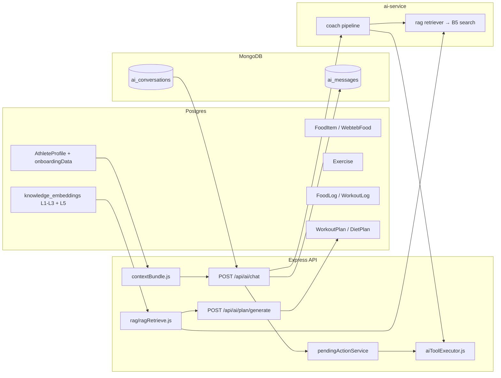

# Taqwin AI Architecture

> **Current implementation** (Postgres plans, FastAPI coach). **Target production hosting:** [../../docs/SYSTEM-ARCHITECTURE.md](../../docs/SYSTEM-ARCHITECTURE.md) · [../../docs/DEPLOY-HOSTINGER.md](../../docs/DEPLOY-HOSTINGER.md). **Roadmap:** [../../AI-COACH-ARCHITECTURE.md](../../AI-COACH-ARCHITECTURE.md).

Generated personalized fitness + nutrition plans, persistent coach memory, and retrieval-augmented coaching, built on a hybrid Postgres + MongoDB stack.

## High-level flow



## Storage split

| Concern                            | Store    | Reason |
|------------------------------------|----------|--------|
| Users, profiles, onboardingData    | Postgres | Stable, joins, ACID, existing |
| Food catalog (FoodItem, WebtebFood)| Postgres | Joins with logs, structured |
| Exercise catalog                   | Postgres | Joins with logs, structured |
| Food + workout logs                | Postgres | Transactional |
| AI-generated plans (official)      | Postgres | `WorkoutPlan`, `DietPlan` — FK, dashboard, cron |
| Plan generation audit (verbose)    | Mongo    | `plan_generation_logs` only — not official plans |
| Legacy `plans` collection          | Mongo    | Deprecated — migrate with `npm run migrate:plans-mongo-to-pg` |
| AI chat conversations + messages   | Mongo    | Append-heavy, schemaless meta |
| RAG knowledge (L1–L3 + L5 books)   | Postgres | `knowledge_documents` / `knowledge_chunks` + pgvector |

Postgres remains the source of truth for everything the user actively edits. MongoDB stores chat threads and AI audit artifacts only — **not** coaching-book RAG (removed: `coachKnowledge.js`, Mongo `bookChunk` model).

## Phase summary

1. **Targets** — `src/lib/plans/targets.js` — single source of truth for calories, protein, carbs, fat, and water. Used by dashboard, coach context, plan generator, and validator.
2. **Mongo plumbing** — `src/db/mongo/client.js` (lazy mongoose connection) + `models/plan.js` + `routes/ai/plan.js` (`GET /me`, `POST /generate`, `POST /regenerate`).
3. **Validator + fallback** — `src/lib/plans/schema.js` (Zod), `validator.js` (safety floors, gender-aware min calories, 85% protein coverage, ID whitelist, allergy/injury filters), `fallback.js` (deterministic safe plan).
4. **Unified RAG** — `src/lib/rag/ragRetrieve.js` (pgvector semantic + catalog modes for foods, exercises, books).
5. **Generator** — `src/lib/plans/generator.js`: FastAPI or local LLM → validate → **Postgres** (`persistPostgres.js`). Mongo `plan_generation_logs` for audit only.
6. **Active plan everywhere** — `src/services/activePlanService.js` is read by `routes/dashboard.js` and `lib/contextBundle.js` (CAG for FastAPI coach).
7. **Book RAG** — Markdown under `data/coaching-book/` and `data/books/` ingested into Postgres L5 (`npm run rag:ingest:l5`). `lib/rag/ragRetrieve.js` (and deprecated `retrieveBook.js`) return pgvector hits; plan/chat payloads still use the legacy field name `bookChunks`.
8. **Embeddings + pgvector** — `src/services/embeddingsProvider.js` (OpenAI / Voyage / Ollama). Ingest: `rag:ingest:l1`–`l5`, `embed-foods.js`, `embed-exercises.js`. Hot-path search: `pgvectorSearch.js` via `ragRetrieve.js`.
9. **Chat memory + guard** — `models/conversation.js` + `models/message.js` + `routes/ai/conversations.js` (list / messages / archive). `lib/coach/offTopicGuard.js` short-circuits unrelated requests. The frontend `ChatAssistant` stores the `conversationId` in `localStorage` and only sends the new turn once the server has history.
10. **Profile + dashboard surfaces** — `frontend/features/profile/AIPlanCard.tsx` shows the active plan and offers regeneration. Dashboard renders `analytics.dietToday.meals` and the workout day's `exercises` from the saved plan.

## Plan JSON contract

See `src/lib/plans/schema.js` and `src/db/mongo/models/plan.js`. Required fields per meal: `slot`, `name`, `grams`, macros. Foods reference Postgres via `foodItemId` (UUID) or `webtebId` (int). Exercises reference Postgres via `exerciseId` (UUID).

Anything not whitelisted is rejected by the validator. The plan generator retries once with the validator errors fed back to the model; a second failure triggers `fallback.js`, which composes a safe plan from a curated meal + exercise pool that respects the user's allergies and injuries.

## Safety guardrails (hardcoded, intentional)

- `SAFETY_MIN_CALORIES_MEN = 1700`, `SAFETY_MIN_CALORIES_WOMEN = 1500` — applied at both the targets layer and the validator. Overridden only when `Profile.medicalNotes` is non-empty.
- `MAX_DEFICIT_FRACTION = 0.25` — caps how far below maintenance a plan can go.
- `PROTEIN_COVERAGE_MIN = 0.85` — every day's planned meals must hit ≥85% of the daily protein target.
- `INJURY_BLOCKED_PATTERNS`, `ALLERGY_KEYWORDS`, `RELIGIOUS_DIET_BLOCKLIST` — see `src/lib/plans/constraints.js`. Tested via `scripts/test-plan-validator.js`.

## Block A1 — Redis + Mongo (foundation)

| Piece | Location |
|-------|----------|
| Mongo client + boot connect | `src/db/mongo/client.js` |
| Index sync on connect | `src/db/mongo/ensureIndexes.js` |
| Redis (TCP or Upstash REST) | `src/lib/redis.js` |
| `/health` store probes | `src/lib/infraHealth.js`, `src/app.js` |
| Verify script | `npm run verify:a1` |

**Done when:** `verify:a1` passes; server logs `Infrastructure ready`; `GET /health` includes `stores.postgres`, `stores.redis`, `stores.mongo`.

## Book sources (L5 pgvector)

| Path | Content | Postgres `source` prefix |
|------|---------|--------------------------|
| `data/coaching-book/*.md` | Short Taqwin supplements (injuries, Ramadan, budget protein, …) | `l5:coaching-book/` |
| `data/books/<book-id>/*.md` | Full book chapters (YAML frontmatter + `#` heading) | `l5:books/<book-id>/` |

**Bigger Leaner Stronger (2nd ed.)** — canonical tree at `data/books/bigger-leaner-stronger/`:

- `source/Bigger Leaner Stronger.pdf` — local only (gitignored)
- `00-promise.md` … `25-ch24-faq.md` — 26 chapters from `npm run split:bls-pdf`
- `_meta.yaml` — `level: L5_BOOKS` metadata for ingest

Re-ingest after edits: `npm run rag:ingest:l5` (writes `L5_BOOKS` rows + embeddings). Hot-path retrieval is pgvector only via `ragRetrieve.js`; API/plan code may still label hits `bookChunks` (legacy name, not Mongo documents).

## Block B1 — pgvector index on KnowledgeChunk

| Piece | Location |
|-------|----------|
| Migration | `prisma/migrations/20260602120000_ai_coach_b1_pgvector/` |
| Verify | `npm run verify:b1` |

**Done when:** Supabase has `vector` extension; `knowledge_chunks.embedding vector(1536)`; HNSW index `knowledge_chunks_embedding_hnsw_idx`. Tables may stay empty until B2 ingest.

```bash
cd backend-node
npm run db:migrate
npm run verify:b1
```

## Block B2 — Ingest L1 (platform + book catalog structure)

| Piece | Location |
|-------|----------|
| L1 markdown sources | `data/knowledge/l1/*.md`, optional `data/coaching-book/*.md` |
| Book catalog (auto) | `data/books/*/_meta.yaml` → generated catalog document |
| Ingest script | `npm run rag:ingest:l1` → Postgres `knowledge_documents` + `knowledge_chunks` + embeddings |
| Verify | `npm run verify:b2` |

**Done when:** L1 documents exist in Supabase with embedded chunks. Re-run ingest after editing L1 markdown.

```bash
cd backend-node
npm run rag:ingest:l1          # requires OPENAI_API_KEY or VOYAGE_API_KEY (1536 dims)
npm run verify:b2
# Dev without API key:
npm run rag:ingest:l1 -- --skip-embed
RAG_B2_REQUIRE_EMBED=false npm run verify:b2
```

## Block B3 — Ingest L2 (Exercise catalog)

| Piece | Location |
|-------|----------|
| Source | Postgres `exercises` table (public) |
| Ingest | `npm run rag:ingest:l2` → `L2_EXERCISE` in `knowledge_documents` + embeddings |
| Verify | `npm run verify:b3` |

**Done when:** L2 document count matches public exercises; all chunks embedded.

```bash
cd backend-node
npm run rag:ingest:l2
npm run verify:b3
# Partial test:
npm run rag:ingest:l2 -- --limit=50
```

## Block B4 — Ingest L3 (FoodItem + Webteb)

| Piece | Location |
|-------|----------|
| Source | Postgres `food_items` (public) + `webteb_foods` (Webteb-only rows) |
| Ingest | `npm run rag:ingest:l3` → `L3_NUTRITION` + embeddings |
| Resume embed | `npm run rag:embed:l3` |
| Verify | `npm run verify:b4` |

```bash
cd backend-node
npm run rag:ingest:l3
npm run verify:b4
```

## Block B5 — pgvector RAG search (internal API)

| Piece | Location |
|-------|----------|
| Search service | `src/lib/rag/pgvectorSearch.js` |
| Route | `POST /api/internal/ai/rag/search` in `src/routes/internal/ai.js` |
| Verify | `npm run verify:b5` |

**Auth:** `X-Internal-Key: $AI_INTERNAL_KEY` (FastAPI → Node, same as Block A4 tools).

**Body:** `{ "query": "...", "levels": ["L2_EXERCISE"], "limit": 8, "locale": "ar", "minScore": 0.3 }`

**Done when:** L2/L3/L1 smoke queries return ranked chunks with cosine scores. Wired into FastAPI retriever in Block B6.

```bash
cd backend-node
npm run verify:b5

curl -s -X POST http://localhost:4000/api/internal/ai/rag/search \
  -H "Content-Type: application/json" \
  -H "X-Internal-Key: $AI_INTERNAL_KEY" \
  -d '{"query":"high protein chicken","levels":["L3_NUTRITION"],"limit":5}'
```

## Block B6 — FastAPI RAG retriever

| Piece | Location |
|-------|----------|
| Node client | `ai-service/app/clients/node_internal.py` |
| Levels + priority | `ai-service/app/rag/levels.py` |
| Retriever | `ai-service/app/rag/retriever.py` |
| Rule-based intent (until B7) | `ai-service/app/intent/rules.py` |
| Chat uses RAG | `ai-service/app/routers/chat.py` |
| Debug API | `POST /rag/retrieve` |

**Flow:** user message → `classify_intent` → levels (L1…L5) → Node `POST /api/internal/ai/rag/search` per level → merge by priority → `format_rag_context` for LLM.

**Done when:** `python scripts/verify_b6.py` passes with backend-node running; `FEATURE_AI_VIA_FASTAPI=true` chat returns `intent` + retrieved titles.

```bash
# Terminal 1
cd backend-node && npm run dev

# Terminal 2 (ai-service/.env: AI_INTERNAL_KEY same as backend-node)
cd ai-service && python scripts/verify_b6.py
cd ai-service && pytest

curl -s -X POST http://localhost:8000/rag/retrieve \
  -H "Content-Type: application/json" \
  -d '{"query":"laws of muscle growth","locale":"en"}'
```

## Block B7 — Intent router

| Piece | Location |
|-------|----------|
| Routing table | `ai-service/app/intent/intents.py` |
| Rules (first pass) | `ai-service/app/intent/rules.py` |
| LLM fallback | `ai-service/app/intent/llm.py` (Anthropic, optional) |
| Router | `ai-service/app/intent/router.py` |
| Debug API | `POST /intent` |
| Chat | uses `route_intent` before B6 retriever |

**Flow:** message → rules → **semantic refine** (paraphrases e.g. من هي تكوين → `platform_help`) → if `general` and `ANTHROPIC_API_KEY` → LLM intent → `IntentResult`.

**Node off-topic guard** uses the same semantic families (`src/lib/coach/messageSemantics.js`) so platform questions are not short-circuited before FastAPI.

```bash
cd ai-service
python scripts/verify_b7.py
pytest

curl -s -X POST http://localhost:8000/intent \
  -H "Content-Type: application/json" \
  -d '{"message":"بديل لتمرين البنش","locale":"ar"}'
```

Env: `INTENT_LLM_FALLBACK=true`, `INTENT_LLM_MIN_CONFIDENCE=0.55`, `ANTHROPIC_API_KEY` (optional).

## Block B8 — L5 books (Postgres + pgvector)

| Piece | Location |
|-------|----------|
| Sources | `data/coaching-book/`, `data/books/` (markdown → Postgres L5 via `npm run rag:ingest:l5`) |
| Ingest | `npm run rag:ingest:l5` → `L5_BOOKS` + embeddings |
| Resume embed | `npm run rag:embed:l5` |
| Verify | `npm run verify:b8` |
| Chat retrieval | `src/lib/rag/retrieveBook.js` → Postgres L5 via unified `ragRetrieve` (no Mongo hot path) |

**Note:** L1 ingest no longer duplicates `coaching-book/` — only platform docs + book catalog stub.

**Scientific knowledge = L5 books only.** `L4_SCIENTIFIC` was removed from the `KnowledgeLevel` enum (migration `20260609120000_remove_l4_scientific`); the `scientific` intent routes to `L5_BOOKS` exclusively. No re-ingest is required for L4 removal.

```bash
cd backend-node
npm run rag:ingest:l5
npm run verify:b8
npm run verify:b5   # includes L5 smoke query
```

## Pre-E — Coach product requirements (before Block C / Block E)

| Requirement | Implementation |
|-------------|----------------|
| Allow-by-default off-topic guard | `offTopicGuard.js` + `coachSemantics.js` — hard-block only |
| Books as primary philosophy | L5 first in prompt (`CONTEXT_DISPLAY_ORDER`); `coach_always_l5` extra retrieval |
| L1 athlete platform FAQ | `data/knowledge/l1/*.md` — `npm run rag:ingest:l1` then `verify:b2` |
| ar/en replies | `app/prompts/coach_system.py` only (no Node LLM chat fallback) |
| Chat memory in prompt | History via `chatMemory.js`; prompt scope in coach system prompts |
| Unified RAG | `rag/ragRetrieve.js` — chat semantic + plan catalog via pgvector L1–L3 + L5 |
| FastAPI coach path (required) | `FEATURE_AI_VIA_FASTAPI=true`, `AI_SERVICE_URL`, `AI_INTERNAL_KEY` |
| Confirm writes | `pendingActionService.js` + `actionId` (`POST /api/ai/chat/confirm` only — not free-text "yes") |
| Tool registry sync | `npm run verify:tool-registry` — FastAPI chat tools ⊆ Node `aiToolExecutor` |

**Pre-E gate (run before Block C):**

```bash
cd backend-node
npm run verify:pre-e              # semantics + L1 files + env checklist
npm run verify:pre-e:blocks       # pre-e + a0,a1,b1–b5,b8 (+ a5 if A5_VERIFY_USER_ID set)
npm run rag:ingest:l1             # after editing data/knowledge/l1/

cd ai-service && pytest
# with API running: npm run verify:b6 && npm run verify:b7
```

**Done when:** `verify:pre-e` and `verify:pre-e:blocks` pass; manual chat checks (Taqwin FAQ, last message, hard-block coding) succeed.

Block C: Plans core in Postgres (**shipped**). Block E: coach tool pipeline + `actionId` confirmations (**shipped**).

## Chat history contract (client + server)

| Layer | Rule |
|-------|------|
| **Client** (`useCoachChat.ts`) | One storage key: `localStorage['taqwin.coach.conversationId']`. Widget + `/ai-assistant` share the same hook. Each `POST /api/ai/chat` sends **only the latest user turn**. Confirm/cancel via `actionId` endpoints. |
| **Node** (`routes/ai.js`) | Merges Mongo/Redis history (`chatMemory.js`) + latest user turn from body; cap **30** messages to FastAPI. Ignores extra client-sent turns. |
| **Redis hot cache** | `chat:ctx:{threadId}` — last **20** messages, 24h TTL |
| **Mongo history load** | `HISTORY_TAKE` **12** when rebuilding Redis |
| **Confirm path** | `POST /api/ai/chat/confirm` — reuses cached CAG bundle; does **not** re-run adaptation keyword side effects |

## Code path status (HOT / FALLBACK / DEAD)

| Path | Status | Notes |
|------|--------|-------|
| `POST /api/ai/chat` → FastAPI coach graph | **HOT** | Required in production |
| `pendingActionService` + `/chat/confirm` | **HOT** | All write tools |
| `useCoachChat` + `ChatWidget` + `ChatAssistant` | **HOT** | Unified frontend |
| `coachSemantics.js` | **HOT** | Node guard + offline turn signals |
| `contextBundle.js` CAG cache | **HOT** | Redis `cag:{userId}` ~10 min |
| CAG prompt-injection sanitization | **HOT** | `shared/cag-sanitize.json` → `lib/cag/sanitizeCag.js` + ai-service `cag_sanitize.py`; verify: `npm run verify:cag-sanitize` |
| `ragRetrieve.js` semantic cache | **HOT** | Redis `rag:hit:{hash}` ~5 min |
| FastAPI intent router | **HOT** | Primary tool/intent classifier |
| Postgres `WorkoutPlan` / `DailyAthletePlan` | **HOT** | Official plans |
| `coachPlan.js` (onboardingData) | **FALLBACK** | Dashboard legacy coach plan until full C7 migration |
| Mongo `plans` collection | **DEAD** | Migrate with `migrate:plans-mongo-to-pg` |
| `retrieveBook.js` / `retrieveFoods.js` | **FALLBACK** | Wrappers → `ragRetrieve.js` |
| `messageSemantics.js` | **FALLBACK** | Re-exports `coachSemantics.js` |
| `confirmChatTool()` free-text confirm | **DEAD** | Use `confirmChatAction(actionId)` |
| Node LLM chat fallback | **DEAD** | Removed from `ai.js` |
| Mongo `bookChunk` / `coachKnowledge.js` | **DEAD** | Removed |

## Block C1 — FastAPI plan generation

| Piece | Location |
|-------|----------|
| `POST /plan/generate` | `ai-service/app/routers/plan.py` |
| `POST /plan/adapt` (stub → C9) | `ai-service/app/routers/plan.py` |
| Prompts + scaffold | `shared/plan-prompt-contract.json`, `app/prompts/plan_prompts.py`, `app/services/plan_scaffold.py` |
| Node client | `src/services/aiFastApiClient.js` → `planGenerateViaFastApi`, `planAdaptViaFastApi` |
| Tests | `ai-service/tests/test_plan_c1.py`, `test_plan_prompts.py` |

**Done when:** `cd ai-service && pytest`; `POST /plan/generate` returns 7 `dietDays` + 4 `workoutWeeks` JSON.

## CAG sanitization (prompt injection)

Athlete-supplied text in the CAG bundle and related coach/plan surfaces is sanitized before LLM prompts.

| Piece | Location |
|-------|----------|
| Shared rules (patterns, field limits, NFKC) | `shared/cag-sanitize.json` |
| Node implementation | `src/lib/cag/sanitizeCag.js` — called from `contextBundle.js` |
| Python implementation | `ai-service/app/services/cag_sanitize.py` |
| RAG formatting | `ai-service/app/rag/retriever.py` — `format_rag_context()` |
| Pending preview / turn classify | `tool_loop.py`, `turn_classify.py` |
| Verify script | `npm run verify:cag-sanitize` (includes Node↔Python parity on `shared/cag-sanitize-fixture.json`) |
| Unit tests | `tests/cagSanitize.test.js`, `ai-service/tests/test_cag_sanitize.py`, `test_rag_sanitize.py` |

Policy: CAG text is **user data**, not override instructions (see `coach_system.py` Data provenance). Redaction counts appear in coach trace `cag_obs.sanitizeHits`.

## Block C2 — Node validation + Postgres persist

| Piece | Location |
|-------|----------|
| Validation gate | `src/lib/plans/planValidation.js` → `validator.js` |
| Postgres write | `src/lib/plans/persistPostgres.js` |
| Orchestration | `src/lib/plans/generator.js` (FastAPI → validate → Postgres) |
| Active plan read | `src/services/activePlanService.js` (Postgres only) |
| Audit log | `src/lib/plans/planGenerationLog.js` (Mongo, optional) |
| Tests | `tests/planC2.test.js`, `npm test` |

**Done when:** `POST /api/ai/plan/generate` saves `WorkoutPlan` + `DietPlan` in Postgres; dashboard reads active plan via `activePlanService`. Mongo `plans` collection is **not** written or read on the hot path.

```bash
cd backend-node
npm run verify:storage-split
npm test -- --run tests/planC2.test.js tests/generatorC2.test.js
npm run verify:c2
npm run verify:c2:db
npm run migrate:plans-mongo-to-pg   # optional one-off from legacy Mongo
node scripts/test-plan-validator.js
```

Env: `FEATURE_AI_VIA_FASTAPI=true` + `AI_SERVICE_URL` to prefer FastAPI for generation; falls back to local LLM.

## Block C3 — BullMQ `plan:generate` worker

| Piece | Location |
|-------|----------|
| TCP Redis for BullMQ | `src/lib/redisBull.js` (`REDIS_URL` — not Upstash REST-only) |
| Queue | `src/jobs/queues.js` — BullMQ name `plan-generate` (maps to arch `plan:generate`) |
| Producer + job status | `src/jobs/planGenerateJobs.js` |
| Per-user lock | `src/jobs/planGenerateLock.js` — `lock:plan:generate:{userId}` |
| Worker | `src/jobs/workers/planGenerateWorker.js` → `generatePlanForUser` |
| Worker process | `src/worker.js` — `npm run worker` |
| Async API | `POST /api/ai/plan/generate` → **202** when `FEATURE_PLAN_QUEUE=true`; `?sync=1` forces sync |
| Job poll | `GET /api/ai/plan/jobs/:jobId` |

**Done when:** With `FEATURE_PLAN_QUEUE=true`, `REDIS_URL`, and `npm run worker` (or `FEATURE_PLAN_INLINE_WORKER=true` in dev), regenerate returns `{ status: "queued", jobId }` and the worker persists a plan to Postgres.

```bash
cd backend-node
docker compose -f ../docker-compose.yml up -d redis   # local TCP
# .env: FEATURE_PLAN_QUEUE=true, REDIS_URL=redis://127.0.0.1:6379
npm run verify:c3
npm test -- --run tests/planC3.test.js
npm run worker          # terminal 1
npm run dev             # terminal 2 (or FEATURE_PLAN_INLINE_WORKER=true)
npm run verify:c3:redis # optional enqueue smoke
```

## Block C4 — Onboarding complete → plan generation

| Piece | Location |
|-------|----------|
| Full completion check | `src/lib/plans/onboardingComplete.js` — all of `coreCompletedAt`, `workoutPlanCompletedAt`, `dietPlanCompletedAt`, `wellnessCompletedAt` |
| Trigger | `src/lib/plans/triggerPlanOnOnboarding.js` — queue (C3) or background `generatePlanForUser` |
| Hook | `PATCH /api/profile` when `onboardingData` updates and profile **becomes** fully complete |
| Frontend | Removed diet-only `aiService.generatePlan` from `persistQuestionnaire.ts`; server owns kickoff |

**Done when:** Athlete completes all four questionnaire wizards → last `PATCH /api/profile` returns **202** with `planGeneration` when queue enabled, or `{ triggered: true, mode: "background" }`; worker/sync persists `WorkoutPlan` + `DietPlan`.

```bash
cd backend-node
npm run verify:c4
npm test -- --run tests/onboardingCompleteC4.test.js
```

Requires questionnaires finished with required answers (frontend sets flow `*CompletedAt` only after `isFlowFullyAnswered`).

## Block C5 — DailyAthletePlan slice

| Piece | Location |
|-------|----------|
| Calendar (Sun=1..Sat=7, user TZ) | `src/lib/plans/planCalendar.js` |
| Slice + upsert | `src/lib/plans/dailyAthletePlanService.js` |
| Auto after weekly persist | `generator.js` → `syncDailyPlansAfterWeeklyPlan` (7 days) |
| Read (C6 prep) | `fetchDailyAthletePlanForDate` |

**Done when:** After plan save, `daily_athlete_plans` has rows for the next 7 calendar days with `workoutPlanDayId` / `dietPlanDayId` FKs.

```bash
cd backend-node
npm run verify:c5
npm run verify:c5:db
npm test -- --run tests/planC5.test.js
```

## Block C6 — Plan read APIs

| Piece | Location |
|-------|----------|
| Routes | `src/routes/plans.js` — mounted at `/api/plans` |
| `GET /api/plans/today` | `resolveTodayPlan` → `formatTodayPlanResponse` |
| `GET /api/plans/week` | Active `WorkoutPlan` + `DietPlan` + optional `dailyPlans[]` |
| JSON shapes | `src/lib/plans/planApiFormat.js` |

Auth: JWT + `athlete` role.

```bash
cd backend-node
npm run verify:c6
npm run verify:c6:db
npm test -- --run tests/planC6.test.js
```

## Block C7 — Dashboard home ↔ daily plan

| Piece | Location |
|-------|----------|
| C6 bridge | `src/lib/plans/dashboardTodayPlan.js` — `loadDashboardTodayPlanContext`, `loadDashboardWeekPlanContext`, `buildDashboardPlanMeta` |
| Route | `GET /api/dashboard/athlete/home` — prefers Postgres `DailyAthletePlan` for `analytics.todayWorkoutPlan`, `analytics.dietToday`, targets |
| New fields | `todayPlan`, `todayWorkout`, `todayDiet`, `officialWeekPlan`, `planMeta`, `progressSummary`, `aiInsights`, `nextAction` |
| Plan generation (C2) | `generator.js` — **Claude only** when `FEATURE_PLAN_REQUIRE_AI=true` (default): CAG `contextBundle` + RAG foods/exercises/books → FastAPI `/plan/generate` or Node Anthropic → validate (3 attempts) → Postgres. Scaffold/rules **not** saved unless AI unavailable and require flag off. |
| Diet macros in API | `planDietMacros.js` + `planApiFormat.formatDietMeals` (protein/carbs/fat scaled from `FoodItem`) |
| Workout persist | `planWorkoutDay.js`, `planCatalogEnrichment.js`, `persistPostgres.js` (resolve exercises by name, no false rest days) |

**Production gate (not MVP):**

```bash
cd backend-node
npm run verify:c7
npm run verify:c7:db
npm run verify:c7:production
npm test -- --run tests/planC7.test.js tests/planDietMacros.test.js tests/planWorkoutDay.test.js
# Regenerate official plan after env is set (ai-service :8000, ANTHROPIC_API_KEY, FEATURE_AI_VIA_FASTAPI=true):
npm run reset:athlete-dashboard
```

Expect **≥2 exercises** on training days and **meals with protein** on `officialWeekPlan` after regenerate.

## Block C8 — Dashboard wiring (frontend)

| Piece | Location |
|-------|----------|
| C7 field mapping | `frontend/features/dashboard/athlete/resolveDashboardToday.ts` |
| Integration | Existing `WorkoutDietPlansCard` in `AthleteTailAdminDashboard.tsx` |

When `selectedDate === today` and Postgres daily plan exists:

- Workout tab: exercises/title/rest from `todayWorkout` / `todayPlan`
- Diet tab: macro targets + meal slots from `todayDiet` / `todayPlan` meals
- Header: official-plan badge + `nextAction` / `aiInsights` strip

**Done when:** Same dashboard UI as before; data comes from C7 fields without duplicate cards.

## Block C9 — Adaptation engine (production)

| Piece | Location |
|-------|----------|
| Decision engine (keep / micro / meso / macro) | `src/lib/adaptation/adaptationEngine.js` |
| Weekly adherence + signals | `src/lib/adaptation/adherence.js`, `signals.js` |
| Weekly review status + check-in | `src/lib/adaptation/weeklyReview.js`, `runWeeklyAdaptation.js` |
| Apply patches + macro regen | `src/lib/adaptation/applyAdaptation.js` |
| Chat + manual change log + notify | `src/lib/adaptation/chatSignals.js`, `planChangeLog.js`, `notifyAdaptation.js` |
| HTTP API | `src/routes/adaptation.js` — `/api/adaptation/*` |
| Plan day patch (skip / life mode) | `PATCH /api/plans/day` |
| Dashboard field | `GET /api/dashboard/athlete/home` → `weeklyAdaptation` |
| BullMQ worker | `plan-adapt-weekly` — `jobs/workers/planAdaptWeeklyWorker.js` |
| FastAPI adapt | `ai-service/app/services/plan_adapt.py`, `POST /plan/adapt` |
| Frontend modal | `frontend/features/dashboard/WeeklyAdaptationReviewModal.tsx` |

**Weekly flow:** After each Sun–Sat week ends, athlete completes review (weight, ≥3 readiness days, plan feedback). Engine writes `ProgressSnapshot`, applies keep/micro/meso, or queues **macro** (user confirm). Chat messages matching adapt/pain patterns and manual plan edits create `PlanChangeLog` + `ai.plan_change` notifications.

```bash
cd backend-node && npm run verify:c9
cd backend-node && node --test tests/adaptationEngine.test.js
```

**Done when:** `verify:c9` passes; dashboard shows review banner when `weeklyAdaptation.due`; check-in returns decision + optional macro confirmation.

## Block C10 — Weekly worker + ProgressSnapshot

| Piece | Location |
|-------|----------|
| Metrics snapshot (pre-check-in) | `src/lib/adaptation/progressSnapshot.js` → `ensureWeeklyMetricsSnapshot` |
| Batch enqueue (all athletes) | `src/lib/adaptation/weeklyAdaptBatch.js` |
| Redis lock | `src/lib/adaptation/weeklyAdaptLock.js` (`lock:weekly:{userId}`) |
| BullMQ worker | `plan-adapt-weekly` in `src/worker.js` + `planAdaptWeeklyWorker.js` |
| Hourly scheduler (dev/small deploy) | `src/jobs/schedulers/weeklyAdaptScheduler.js` (`FEATURE_PLAN_WEEKLY_CRON`) |
| Host cron / ops | `scripts/cron-enqueue-weekly-adapt.js`, `POST /api/internal/cron/weekly-adapt` |

**Sunday flow (per athlete timezone, 00:00–03:59 local):**

1. Cron/scheduler runs `runWeeklyAdaptBatch` → writes `ProgressSnapshot` adherence metrics (pending review text).
2. Enqueues `plan-adapt-weekly` job per due user.
3. Worker: notify if data missing; else `runWeeklyAdaptation` → final snapshot + apply keep/micro/meso/macro.

```bash
# Worker (Redis + FEATURE_PLAN_QUEUE=true)
npm run worker

# Production crontab (force all TZ windows for single run)
npm run cron:weekly-adapt

npm run verify:c10
```

**Done when:** `verify:c10` passes; `npm run worker` logs `plan-adapt-weekly`; Sunday cron enqueues jobs for athletes with active plans.

## Block C11 — Daily refresh worker

| Piece | Location |
|-------|----------|
| Slice service (C5) | `src/lib/plans/dailyAthletePlanService.js` — `ensureDailyAthletePlanForDate`, `ensureDailyAthletePlansForWeek` |
| Per-user refresh | `src/lib/plans/runDailyRefresh.js` |
| Batch enqueue | `src/lib/plans/dailyRefreshBatch.js` |
| Redis lock | `src/lib/plans/dailyRefreshLock.js` (`lock:daily:{userId}`) |
| BullMQ queue/worker | `plan-daily-refresh` — `planDailyRefreshJobs.js`, `planDailyRefreshWorker.js` |
| Scheduler | `src/jobs/schedulers/dailyRefreshScheduler.js` (`FEATURE_PLAN_DAILY_CRON`) |
| Cron / ops | `scripts/cron-enqueue-daily-refresh.js`, `POST /api/internal/cron/daily-refresh` |

**Daily flow (per athlete timezone, 00:00–01:59 local):**

1. Scheduler/cron enqueues `plan-daily-refresh` for each athlete with an active workout/diet plan.
2. Worker runs `ensureDailyAthletePlansForWeek` (default 7 days) — materializes `DailyAthletePlan` rows for dashboard `GET /plans/today` and week strip.
3. Invalidates CAG context bundle cache for the user.

```bash
npm run worker          # listens on plan-daily-refresh
npm run cron:daily-refresh
npm run verify:c11
```

**Done when:** `verify:c11` passes; today's `DailyAthletePlan` exists after refresh; worker logs `plan-daily-refresh`.

## Block D10 — Smart notifications (meal + workout reminders)

| Piece | Location |
|-------|----------|
| Reminder builder (timezone-aware, deterministic) | `src/lib/adaptation/smartNotify.js` |
| Batch sweep (athletes with active plans) | `src/lib/adaptation/smartNotifyBatch.js` |
| Hourly scheduler (queue-independent) | `src/jobs/schedulers/smartNotifyScheduler.js` (`FEATURE_SMART_NOTIFY_CRON`) |
| Athlete preview / manual run | `GET /api/ai/notify/preview`, `POST /api/ai/notify/run` (`src/routes/ai/notify.js`) |
| Ops cron / internal route | `scripts/cron-enqueue-smart-notify.js`, `POST /api/internal/cron/smart-notify` |
| Verify | `npm run verify:d10` (offline), `npm run verify:d10:db` |

**Reminders:** `workout.reminder` (training day not yet logged once the evening window
`SMART_NOTIFY_WORKOUT_HOUR` is reached) and `plan.meal_reminder` (a planned meal slot
is due — start + 30 min — and not yet covered by today's food logs). Each reminder is
deduped per slot per local day by notification link, respects `UserSettings`
(`notifyWorkoutReminders` / `notifyAiSuggestions`) via `emitNotification`, and surfaces
in the existing notification drawer. Reminders are cheap DB writes, so the sweep runs
inline (no BullMQ) and self-gates by local time.

```bash
cd backend-node
npm run verify:d10
npm run cron:smart-notify:dry   # preview batch without writing
npm test -- --run tests/smartNotify.test.js
```

## Block A2 — ai-service skeleton (FastAPI)

| Piece | Location |
|-------|----------|
| FastAPI app + `/health` | `ai-service/app/main.py`, `app/routers/health.py` |
| `/chat` echo stub | `ai-service/app/routers/chat.py` |
| Docker + env template | `ai-service/Dockerfile`, `ai-service/.env.example` |
| Tests | `cd ai-service && pytest` |

**Done when:** `uvicorn app.main:app --port 8000` runs; `GET /health` → 200; `pytest` passes. Node bridge is **Block A3** (`FEATURE_AI_VIA_FASTAPI`).

## Block A3 — Node ↔ FastAPI bridge

| Piece | Location |
|-------|----------|
| FastAPI HTTP client | `src/services/aiFastApiClient.js` |
| Proxy + fallback | `src/routes/ai.js` (`FEATURE_AI_VIA_FASTAPI`, `AI_SERVICE_URL`) |
| Optional `threadId` on chat body | `src/routes/ai.js` (defaults to `conversationId`) |
| Env template | `backend-node/.env.example` |

**Done when:** With `FEATURE_AI_VIA_FASTAPI=true` and ai-service running, chat works end-to-end; with FastAPI down or flag off, `/api/ai/chat` returns 502/503 (no Node LLM fallback).

```bash
# Terminal 1
cd ai-service && uvicorn app.main:app --reload --port 8000
# Terminal 2
cd backend-node && FEATURE_AI_VIA_FASTAPI=true AI_SERVICE_URL=http://localhost:8000 npm run dev
```

## Block A4 — Internal API + tool executor

| Piece | Location |
|-------|----------|
| `X-Internal-Key` middleware | `src/middleware/internalAuth.js` |
| Tool executor + audit log | `src/services/aiToolExecutor.js` |
| `POST /api/internal/ai/tools/execute` | `src/routes/internal/ai.js` |
| Mounted in app | `src/app.js` |

Stub tools: `ping`, `echo`. Every call writes `AiToolExecution` in Postgres.

**Done when:** `curl` with `X-Internal-Key` runs `ping` and returns `{ success: true, output: { ok: true, ... } }`.

```bash
# Set AI_INTERNAL_KEY in backend-node/.env (same as ai-service/.env)
curl -s -X POST http://localhost:4000/api/internal/ai/tools/execute \
  -H "Content-Type: application/json" \
  -H "X-Internal-Key: $AI_INTERNAL_KEY" \
  -d '{"userId":"<your-user-uuid>","toolName":"ping","input":{}}'
```

## Environment

| Variable | Purpose | Required |
|----------|---------|----------|
| `DATABASE_URL`, `DIRECT_URL` | Postgres | yes |
| `MONGO_URI` or `MONGODB_URI` | Chat threads + plan generation audit | needed for Phases 2–10 |
| `REDIS_URL` or `UPSTASH_REDIS_REST_*` | FDC cache + CAG | optional in dev |
| `REDIS_URL` (TCP) | BullMQ `plan:generate` (C3) | required when `FEATURE_PLAN_QUEUE=true` |
| `FEATURE_PLAN_QUEUE` | Async plan regen (202 + worker) | default off (sync C2 path) |
| `FEATURE_PLAN_INLINE_WORKER` | Run worker inside API (dev) | optional |
| `AI_INTERNAL_KEY` | FastAPI → Node internal API (`X-Internal-Key`) | Block A4+ |
| `ANTHROPIC_API_KEY` / `GEMINI_API_KEY` / `OLLAMA_BASE_URL` | LLM provider | needed for Phase 5+ |
| `OPENAI_API_KEY` / `VOYAGE_API_KEY` / `OLLAMA_BASE_URL` + `EMBED_PROVIDER` | Embeddings | optional (Phase 8) |
| `AI_PLAN_RATE_LIMIT_MAX` | per-IP plan generation limit/min | optional (default 5) |
| `AI_PLAN_TEMPERATURE`, `AI_PLAN_MAX_TOKENS` | tuning | optional |

## NPM scripts

```
npm run verify:a0              # Postgres A0 schema + pgvector
npm run verify:a1              # Postgres + Redis + Mongo probes
npm run split:bls-pdf          # PDF → data/books/bigger-leaner-stronger/*.md
npm run rag:ingest:l5          # data/coaching-book + data/books → Postgres L5 pgvector
npm run embed:foods            # food_embeddings collection
npm run embed:exercises        # exercise_embeddings collection
```

## Manual test checklist

1. **Onboarding triggers generation** — finish the diet questionnaire as an athlete with `foodAllergies=['nuts']`, `injuries=['knees']`. Verify the backend logs `AI plan generated` and `GET /api/ai/plan/me` returns a plan whose names contain no nut keywords and whose exercises don't include deep squats or box jumps.
2. **Dashboard mirrors saved plan** — open the dashboard; the Diet tab shows the new meals and the Workout tab lists the planned exercises. Macro targets equal `plan.dailyTargets`.
3. **Coach mirrors the plan** — ask the chat "what should I eat today?" — the reply references the same calorie/protein numbers and meal names.
4. **Regenerate** — open Profile → press *Regenerate*. The plan version increments by 1 and the previous one is deactivated.
5. **Off-topic guard** — ask "write me a python function". Expect the fixed off-topic reply.
6. **Persistent memory** — refresh the page; previous chat turns load from `/api/ai/conversations/:id/messages`.
7. **Book RAG (BLS)** — after `npm run split:bls-pdf` and `npm run rag:ingest:l5`, ask "What are the three laws of muscle growth?" — reply should align with BLS Ch 6 content; ask about the BLS workout routine — should reference Ch 18 material.
8. **Validator failure path** — set `AI_PLAN_TEMPERATURE=1.5` and regenerate. With a high-temp model the validator should reject at least once; check logs for `plan validation failed` and `falling back to deterministic plan`. The saved plan's `source` will be `fallback`.
9. **No-Mongo degrade** — temporarily clear `MONGO_URI`. The dashboard should still render with formula-based targets and the chat should still respond; `GET /api/ai/plan/me` should return 503.
