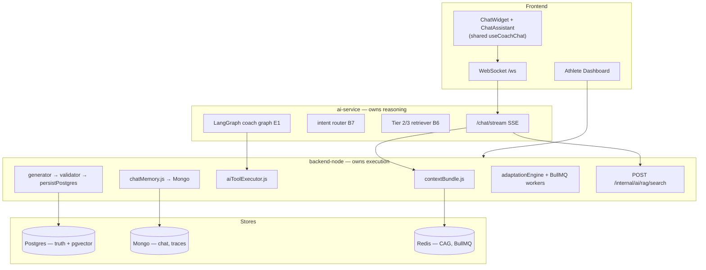

# Taqwin — AI Project Review & Task Organization

**Last updated:** 2026-06-13  
**Scope:** AI Coach (Blocks A–E), RAG, production finish, graduation defense  
**Canonical sources:** [Taqwin.md](../Taqwin.md) · [AI-COACH-ARCHITECTURE.md](../AI-COACH-ARCHITECTURE.md) · [backend-node/docs/AI_ARCHITECTURE.md](../backend-node/docs/AI_ARCHITECTURE.md)

This document replaces the June 8, 2026 Cursor chat export. Use it for **AI-only status** and verify commands.

> **Full master plan (product + AI + production + profit):** [TAQWIN-MASTER-PLAN.md](./TAQWIN-MASTER-PLAN.md)

---

## Executive summary

The AI Coach is **feature-complete for graduation MVP**. Blocks A–E are implemented: CAG context, pgvector RAG (L1–L3 + L5), Tier 2/3 hybrid retrieval, intent routing, plan generation/validation/persist, daily/weekly/mid-week adaptation, LangGraph tool agent (~47 chat tools), WebSocket streaming UI, confirmation flow, memory pipeline, and smart notifications.

**Still open for “production done”:** Hostinger Docker deploy validated end-to-end, live RAG re-ingest on VPS, live E2E evidence, graduation demo recording.

| Area | Status |
|------|--------|
| Plans pipeline (Block C) | ✅ Shipped |
| RAG + intent (Block B) | ✅ Shipped (L4 removed by design) |
| Smart layer (Block D) | ✅ Mostly shipped (D9 deload worker partial) |
| Agent + tools (Block E) | ✅ Shipped |
| WS streaming chat | ✅ Shipped (`verify:ws-streaming`) |
| Production VPS deploy | ⏳ Compose ready; live validation pending |
| Form-check / food vision | 📋 Backlog (v2) |

---

## 1. Architecture (current)



### Golden rules

| Rule | Where |
|------|--------|
| Node writes all business data | `aiToolExecutor.js`, `persistPostgres.js` |
| FastAPI never touches Postgres | Node internal API only |
| Postgres = official plans, logs, profiles, RAG | Prisma + `KnowledgeChunk` |
| Mongo = chat history, agent traces, generation audit | `ai_messages`, `agentTrace` |
| Redis = CAG cache, BullMQ, rate limits | `cag:{userId}`, workers |

### One chat turn (production path)

1. SPA opens **WebSocket** → Node bridges to FastAPI **`/chat/stream`** (SSE tokens).
2. Node builds **CAG bundle** (profile, active plan, today logs, targets, behavioral signals) — cached in Redis.
3. Node loads conversation history from Mongo.
4. FastAPI: **intent router** → **Tier 2/3 RAG** (hybrid pgvector + metadata + optional rerank) → **Claude** streaming reply.
5. **Mutations:** confirmation via `actionId` on WS (`coach.confirm`, `coach.disambiguate`) → LangGraph/tool loop → Node tool executor → Postgres `AiToolExecution` → cache invalidation.
6. REST `POST /api/ai/chat` remains for **scripts/verify only** — not used by the SPA.

### Knowledge layers (RAG)

| Level | Source | Status |
|-------|--------|--------|
| L1 | `data/knowledge/l1/*.md` (17 topics, en + ar) | ✅ `rag:ingest:l1`, `verify:b2` |
| L2 | Postgres `exercises` (~1,981) | ✅ `rag:ingest:l2`, `verify:b3` |
| L3 | `food_items` + WebTeb (~2,243) | ✅ `rag:ingest:l3`, `verify:b4` |
| ~~L4~~ | ~~Scientific PDFs~~ | **Removed** — migration `20260609120000_remove_l4_scientific`; `scientific` intent → L5 |
| L5 | `data/coaching-book/` + `data/books/` | ✅ `rag:ingest:l5`, `verify:b8`, `verify:l5-coaching` |

### RAG tiers (retrieval stack)

| Tier | What | Key files |
|------|------|-----------|
| **1** | Query rewrite, per-level score floors | `ai-service/app/rag/query_rewrite.py`, `scores.py` |
| **2** | Hybrid search (pgvector + full-text RRF), metadata filters, rerank | `backend-node/src/lib/rag/hybridSearch.js`, `ai-service/app/rag/rerank.py` |
| **3** | Retrieval policies, citations, observability | `retrieval_policies.py`, `ragObservabilityService.js` |

Verify: `verify:tier2-rag`, `verify:tier3-rag`, `verify:b6` (included in `verify:pre-e:blocks`).

---

## 2. Block-by-block status

### BLOCK A — Foundation ✅ Done

| Block | What | Verify |
|-------|------|--------|
| A0 | Prisma schema, pgvector, plans, `AiMemory`, `AiToolExecution` | `verify:a0` |
| A1 | Redis + Mongo clients, `/health` probes | `verify:a1` |
| A2 | FastAPI skeleton + `/health` | `pytest` |
| A3 | Node ↔ FastAPI bridge (**no Node LLM fallback**) | `FEATURE_AI_VIA_FASTAPI=true` |
| A4 | Internal API + tool executor + audit | internal `ping` curl |
| A5 | CAG bundle + Redis cache + chat memory | `verify:a5` |

### BLOCK B — RAG + Intent ✅ Done

| Block | What | Verify |
|-------|------|--------|
| B1 | pgvector on `knowledge_chunks` | `verify:b1` |
| B2 | L1 platform docs | `verify:b2` |
| B3 | L2 exercises | `verify:b3` |
| B4 | L3 nutrition | `verify:b4` |
| B5 | Internal RAG search API | `verify:b5` |
| B6 | FastAPI retriever + Tier 2/3 | `verify:b6`, `verify:tier3-rag` |
| B7 | Intent router (rules + semantic + LLM fallback) | `python scripts/verify_b7.py` |
| B8 | L5 coaching books | `verify:b8`, `verify:l5-coaching` |

Pre-E gate:

```bash
cd backend-node
npm run verify:pre-e:blocks   # pre-e + tool-registry + cag-sanitize + a0,a1,b1–b6,b8,tier3-rag
cd ../ai-service && pytest
```

### BLOCK C — Plans core ✅ Done

Onboarding → FastAPI plan JSON → Node validator → Postgres → `DailyAthletePlan` → dashboard.

```bash
npm run verify:block-c:all
npm run verify:c7:production
```

### BLOCK D — Smart layer ✅ Mostly done

| Feature | Status | Notes |
|---------|--------|-------|
| D1 mid-week triggers | ✅ | Worker + scheduler |
| D2 readiness API + UI | ✅ | `DailyReadinessCard` |
| D3 skip day | ✅ | `PATCH /api/plans/day` |
| D4 life modes | ✅ | travel/sick/fasting/injury_flare |
| D5 explainability | ✅ | Dashboard + plan JSON |
| D6 adherence bands | ✅ | `adaptationEngine.js` |
| D7 behavioral signals in CAG | ✅ | `cag/behavioralSignals.js` |
| D8 PlanFeedback weekly | ✅ | Weekly review flow |
| D9 deload week | ⚠️ Partial | L5 deload docs + suggestion text; no dedicated deload worker |
| D10 smart notifications | ✅ | `verify:d10` |

### BLOCK E — Agent + polish ✅ Mostly done

| Feature | Status | Notes |
|---------|--------|-------|
| E1 LangGraph coach graph | ✅ | `ai-service/app/agent/coach_graph.py` |
| E2 Tool loop (max 5) via Node | ✅ | `tool_loop.py`, `aiToolExecutor.js` |
| E3 Mongo agent traces | ✅ | `agentTraceService.js` |
| E4 Long-term memory → `AiMemory` | ✅ | `memoryPipeline.js` + worker |
| E5 Chat confirmation UI | ✅ | WS `coach.confirm` + shared `useCoachChat` |
| E6 Safety guardrails | ✅ | Medical keywords + off-topic guard |
| E7 E2E checklist | ✅ | `verify:e2e-ai`, `verify:e7-integration` |
| E8 CI pytest | ✅ | `.github/workflows/ci.yml` |
| E9 Production deploy | ⏳ | `deploy/docker-compose.production.yml` ready; VPS validation pending |

### Tools

~**47 chat-shipped tools** synced between FastAPI and Node (`verify:tool-registry`).

**Core:** `log_food`, `replace_exercise_today`, `set_life_mode`, `adapt_plan`, `get_nutrition_today`, `get_workout_today`

**Extended (examples):** `update_weight`, `record_readiness`, `skip_day`, `swap_meal`, `search_foods`, `search_exercises`, `get_weekly_adherence`, `calculate_tdee_estimate`

**Disabled from chat:** `generate_weekly_workout`, `generate_weekly_diet`, `request_booking`, `search_trainers` (trainer role removed).

---

## 3. Remaining tasks

### Phase 1 — Validate locally (1 day)

| # | Task | Command |
|---|------|---------|
| 1.1 | Full Pre-E + Block C | `verify:pre-e:blocks`, `verify:block-c:all` |
| 1.2 | Stack: API + AI + worker + Redis + Mongo | `npm run dev` + `uvicorn` + `npm run worker` |
| 1.3 | WS streaming smoke | `npm run verify:ws-streaming` |
| 1.4 | Live food confirm E2E | `verify:e7-confirm-food:full` |
| 1.5 | Tool registry parity | `verify:tool-registry` |
| 1.6 | Manual demo | onboarding → dashboard → WS chat → confirm food log → dashboard refresh |

### Phase 2 — RAG data in Supabase (1 day)

| # | Task | Command |
|---|------|---------|
| 2.1 | Re-ingest after L1/L5 edits | `rag:ingest:l1`, `rag:ingest:l5` |
| 2.2 | Reindex if embedding model changed | `rag:reindex-embeddings` |
| 2.3 | Smoke retrieval | `verify:b5`, `verify:b6`, `verify:tier2-rag`, `verify:tier3-rag` |

### Phase 3 — Production deploy (2–3 days)

| # | Task | Doc |
|---|------|-----|
| 3.1 | Deploy Docker on Hostinger KVM 2 | [DEPLOY-HOSTINGER.md](./DEPLOY-HOSTINGER.md) |
| 3.2 | Env: `FEATURE_AI_VIA_FASTAPI`, `AI_INTERNAL_KEY`, LLM keys | `deploy/.env.production.example` |
| 3.3 | Worker container (plans, memory, notify) | `docker-compose.production.yml` |
| 3.4 | Cron jobs on VPS | `backend-node/scripts/cron-*` |
| 3.5 | Remote health | `verify:production --url https://api.taqwin.online/health` |
| 3.6 | RAG ingest on VPS after deploy | Copy L5 sources if gitignored |

### Phase 4 — Defense polish

| # | Task | Priority |
|---|------|----------|
| 4.1 | Record graduation demo video | High |
| 4.2 | 15-scenario manual matrix (§21 in AI-COACH-ARCHITECTURE.md) | High |
| 4.3 | Gate RAG eval in CI | Medium |
| 4.4 | D9 full deload worker | Low |

### Backlog (not “finish AI”)

Form-check (camera), food vision, mobile app, Stripe, wearables.

---

## 4. Definition of done (graduation)

AI is **finished** when:

1. **Plans path:** Onboarding → Postgres plan → dashboard shows today workout + diet ✅ (code ready)
2. **Chat path:** WS streaming + RAG + tools with confirmation ✅ (code ready)
3. **Adaptation:** Weekly/mid-week/skip/life modes/smart notify ✅ (code ready)
4. **Production:** 4-container Docker deployed, RAG in Supabase, live chat tested ⏳
5. **Evidence:** `verify:pre-e:blocks`, `verify:block-c:all`, `verify:ws-streaming`, manual scenarios ⏳

Not required for graduation: full deload worker, RAG eval in CI, OpenAPI, Stripe.

---

## 5. Defense narrative

**Short:**

> Taqwin’s AI coach is a **governed pipeline**, not one LLM call. **Node** owns athlete truth and all writes; **FastAPI** owns classification, retrieval, and generation. Chat answers from **CAG + RAG (L1–L3, L5)**; mutations go through **confirm → extract → execute → audit**.

**Full paragraph:**

> On every turn, Node assembles a **CAG bundle** from Postgres (profile, active plan, logs, targets, behavioral signals), caches it in Redis, and loads history from Mongo. The SPA streams via **WebSocket** to FastAPI, which **routes intent**, runs **Tier 2/3 hybrid RAG** against pgvector via Node’s internal search API, and **streams a coach reply** with Claude. **Mutations** require **`actionId` confirmation**, then the LangGraph tool loop calls Node’s **tool executor**, which writes Postgres, logs `AiToolExecution`, and invalidates caches. **Weekly plans** follow a separate lifecycle: onboarding triggers **FastAPI JSON → Node validation → Postgres → DailyAthletePlan**, then **adaptation workers** adjust without chat. Dashboard and coach read the same plan via **`activePlanService`** and **`contextBundle`**.

---

## 6. Known technical debt (consolidated)

| Issue | Severity | Notes |
|-------|----------|-------|
| `coachPlan.js` legacy dashboard path | Medium | Postgres plans primary; onboardingData fallback remains |
| Regex-heavy action detection | Medium | MVP OK; edge-case Arabic/English phrasing brittle |
| D9 deload week worker | Low | Text + L5 docs only |
| RAG eval not in CI | Low | Golden dataset + RAGAS exist offline |
| Production not live-validated | **High** | Compose ready; deploy + live E2E pending |
| Marketplace without Stripe | Product | Orders exist; no payments |

**Resolved since June 2026 review:**

- ~~Two chat UIs with different behavior~~ → shared `useCoachChat`
- ~~Node + FastAPI dual LLM chat~~ → Node LLM removed
- ~~L4 hollow schema~~ → L4 removed
- ~~8 tools vs doc registry~~ → ~47 tools + `verify:tool-registry`
- ~~SSE streaming backlog~~ → WS streaming shipped

---

## 7. Scorecard

| Area | Grade | Comment |
|------|-------|---------|
| Architecture design | A- | Node execution + FastAPI reasoning is sound |
| Implementation | A- | Blocks A–E shipped; deploy evidence missing |
| RAG quality | B+ | Tier 2/3 upgrade; needs live ingest + eval gate |
| Tool/agent layer | B+ | Large registry; confirmation + audit in place |
| Production readiness | C+ | Docker ready; VPS validation pending |
| Documentation | B+ | This doc + Taqwin.md aligned with code |

---

## 8. Verify command reference

```bash
# backend-node/
npm run verify:pre-e:blocks      # Pre-E + RAG + tool-registry + tier3
npm run verify:block-c:all       # Plans pipeline
npm run verify:ws-streaming      # WebSocket chat smoke
npm run verify:e7-integration    # Confirm food + cross-service
npm run verify:tool-registry     # FastAPI ⊆ Node tools
npm run verify:production        # Env/readiness checklist

# ai-service/
pytest
python scripts/verify_b7.py      # Intent router
```

---

## Related documentation

| Document | Purpose |
|----------|---------|
| [TAQWIN-MASTER-PLAN.md](./TAQWIN-MASTER-PLAN.md) | **All-in-one** — product, AI, production + profit roadmap |
| [Taqwin.md](../Taqwin.md) | Full feature inventory, routes, media |
| [AI-COACH-ARCHITECTURE.md](../AI-COACH-ARCHITECTURE.md) | Design blueprint (Blocks A–E) |
| [backend-node/docs/AI_ARCHITECTURE.md](../backend-node/docs/AI_ARCHITECTURE.md) | Implementation detail per block |
| [DEPLOY-HOSTINGER.md](./DEPLOY-HOSTINGER.md) | VPS production runbook |
| [SYSTEM-ARCHITECTURE.md](./SYSTEM-ARCHITECTURE.md) | Production topology |
