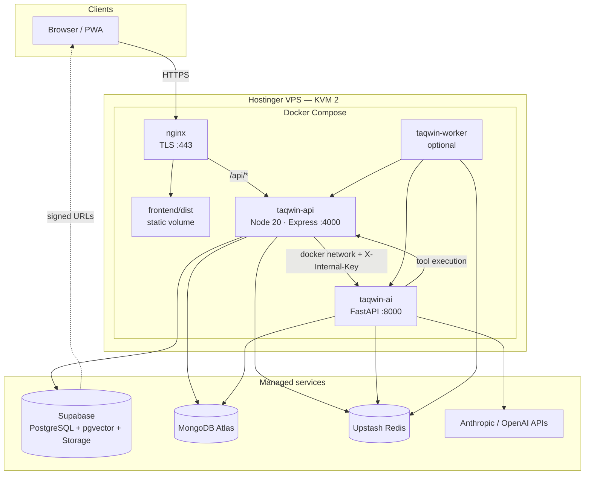
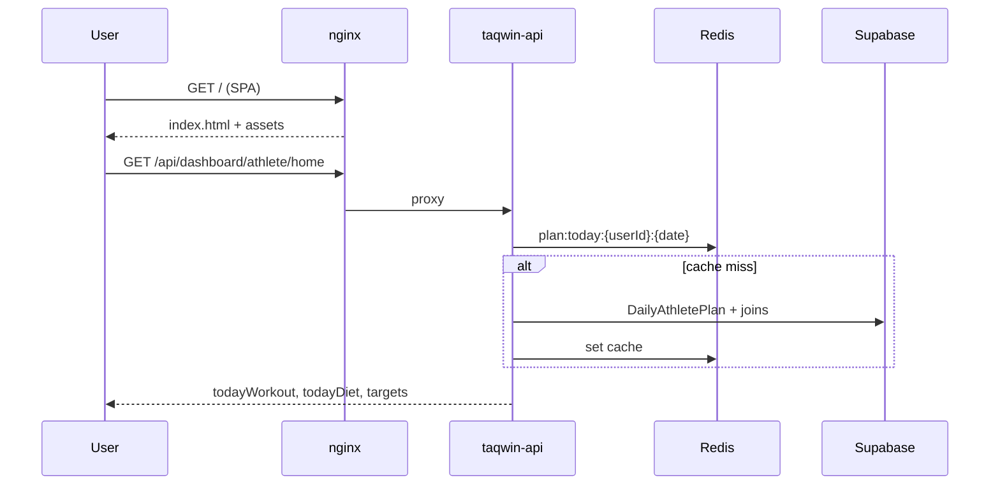
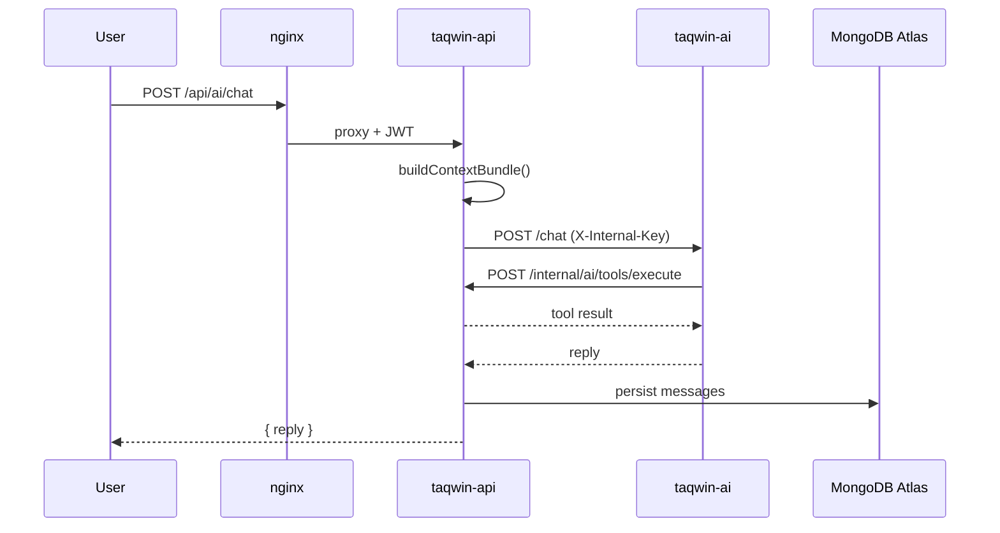
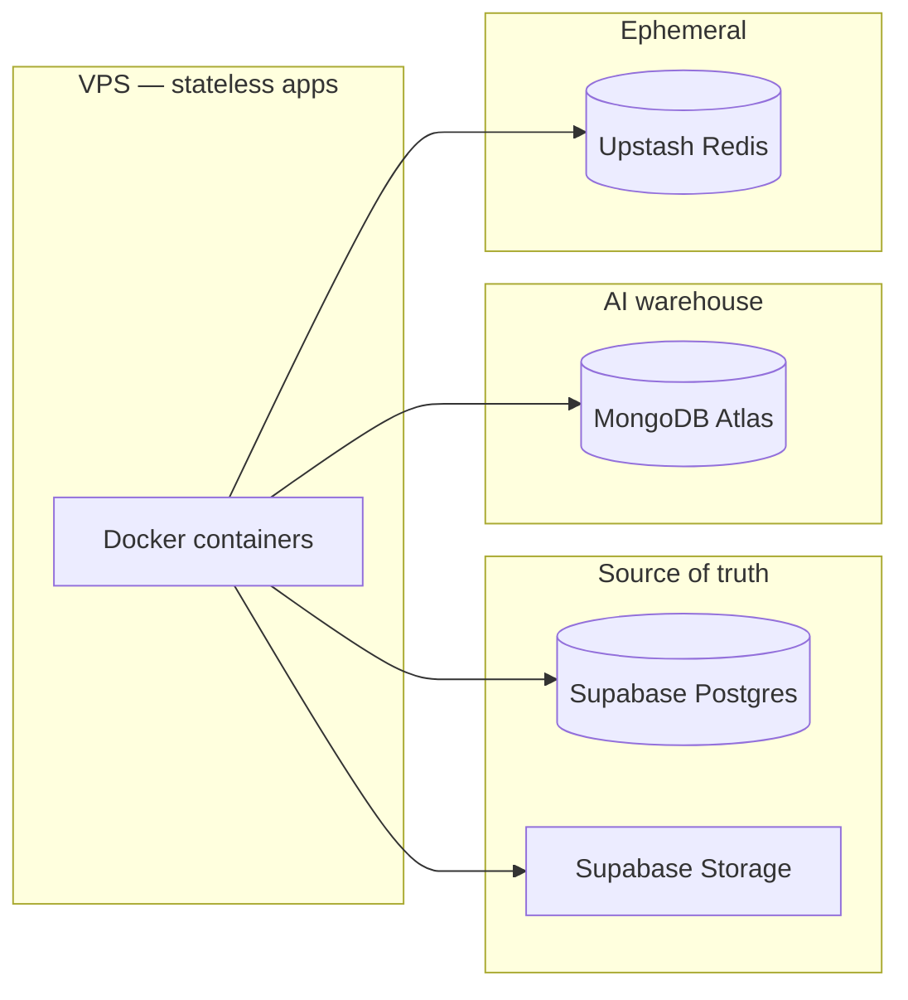

# Taqwin — System Architecture

> **Status:** Target production topology (approved)  
> **Last updated:** 2026-06-10  
> **Related:** [AI Coach blueprint](../AI-COACH-ARCHITECTURE.md) · [Hostinger deploy runbook](./DEPLOY-HOSTINGER.md) · [Current AI implementation](../backend-node/docs/AI_ARCHITECTURE.md)

This document describes how Taqwin is deployed and how components interact. The **primary production target** is a single **Hostinger VPS (KVM 2)** running **Docker Compose**, with managed databases and object storage hosted off the VPS.

---

## 1. Design principles

| # | Rule |
|---|------|
| 1 | **Node.js owns execution** — all transactional writes to PostgreSQL and business rules run in the Express API. |
| 2 | **FastAPI owns reasoning** — LLM calls, intent routing, RAG orchestration, and plan JSON generation (when `ai-service` is enabled). |
| 3 | **FastAPI never writes to PostgreSQL directly** — tools and validation go through Node internal APIs. |
| 4 | **PostgreSQL is the source of truth** for users, official plans, logs, commerce, and audit (`AiToolExecution`). |
| 5 | **MongoDB is the AI warehouse** for chat history, agent traces, and verbose generation logs. |
| 6 | **Redis is ephemeral** — CAG cache, rate limits, hot chat context, and BullMQ (rebuildable from Postgres/Mongo). |
| 7 | **Docker on the VPS packages application processes only** — not production Postgres, MongoDB, or Redis. |

---

## 2. Production topology (Hostinger KVM 2 + Docker)

### 2.1 Overview diagram

### 2.2 Public endpoints

| Hostname | Entry | Backend |
|----------|--------|---------|
| `https://taqwin.com` | nginx | Static SPA (`frontend/dist`) |
| `https://api.taqwin.com` | nginx → `taqwin-api:4000` | Express `/api/*` |
| FastAPI | **Not published** | Reachable only as `http://ai:8000` on the Docker network |

The browser never calls FastAPI or holds LLM API keys.

### 2.3 Why KVM 2

| Resource | KVM 2 | Role for Taqwin |
|----------|-------|-----------------|
| 2 vCPU | Parallel request handling | nginx + Node API + FastAPI under concurrent chat and dashboard load |
| 8 GB RAM | Comfortable headroom | Node (~0.5 GB) + FastAPI (~0.5 GB) + worker + OS + Docker overhead |
| 100 GB NVMe | Application disk | Images, logs, SPA build — not primary databases |
| 8 TB/mo bandwidth | Egress | API and SPA; large media served via Supabase Storage CDN |

KVM 1 is acceptable only for a short-term thesis demo without FastAPI and background workers. KVM 4+ is unnecessary until traffic or self-hosted services justify it.

---

## 3. Docker services

Docker standardizes runtime and startup on the VPS. Databases remain external.

| Service | Image / build | Responsibility | Exposed |
|---------|---------------|----------------|---------|
| **nginx** | `nginx:alpine` | TLS termination, SPA, reverse proxy to API | Public `80`, `443` |
| **taqwin-api** | `backend-node/Dockerfile` | Auth, Prisma, REST API, AI chat proxy, internal tool API | Internal `4000` |
| **taqwin-ai** | `ai-service/Dockerfile` (when added) | Claude, intent, RAG, plan JSON | Internal `8000` only |
| **taqwin-worker** | Same as API, different `command` | BullMQ consumers (plan generate, crons) | None |

Reference Compose file: [`deploy/docker-compose.production.yml`](../deploy/docker-compose.production.yml).

### 3.1 What Docker is not used for

| Component | Hosting | Reason |
|-----------|---------|--------|
| PostgreSQL | Supabase | Backups, pooling, pgvector, ACID |
| MongoDB | MongoDB Atlas | Flexible AI documents, managed ops |
| Redis | Upstash | Shared queues/cache across restarts |
| LLM inference | Vendor APIs | No GPU required on VPS |

---

## 4. Request flows

### 4.1 Dashboard (no chat required)

### 4.2 AI coach chat

Coach chat, plan generation, and memory summarization jobs all require FastAPI (`FEATURE_AI_VIA_FASTAPI=true`, `AI_SERVICE_URL`, `ANTHROPIC_API_KEY` on ai-service). If ai-service is down, `/api/ai/chat` returns 502 and BullMQ plan/memory jobs fail — Node has no in-process LLM fallback.

---

## 5. Data architecture

| Data | Store | Examples |
|------|--------|----------|
| Users, profiles, logs, orders | Postgres | `User`, `FoodLog`, `WorkoutLog` |
| Official workout/diet plans | Postgres | `WorkoutPlan`, `DietPlan`, `DailyAthletePlan` |
| Tool audit | Postgres | `AiToolExecution` |
| Long-term AI preferences | Postgres | `AiMemory` |
| RAG knowledge (L1–L3 + L5 books) | Postgres + pgvector | `KnowledgeDocument`, `KnowledgeChunk` |
| Chat messages, LLM I/O, traces | Mongo | `ai_messages`, `ai_llm_outputs` |
| CAG, today plan, queues | Redis | `cag:*`, `bull:*`, `rl:*` |
| Uploads | Supabase Storage | avatars, food-scans, community media |

**Current codebase note:** Official plans and tool audit live in Postgres. Mongo holds chat, traces, and verbose logs. See [DATABASE-BACKUPS.md](./DATABASE-BACKUPS.md).

---

## 6. Security

- Firewall on VPS: allow **22** (SSH), **80**, **443** only.
- Do not map host port **8000** for FastAPI.
- nginx on `api.taqwin.com` returns **403** for `/api/internal/*` (public Internet). FastAPI → Node uses Docker `http://api:4000` plus `X-Internal-Key`.
- `AI_INTERNAL_KEY` shared secret between `taqwin-api` and `taqwin-ai`.
- LLM keys only in server environment variables (never `VITE_*`).
- Google OAuth redirect URI must use `https://api.taqwin.com/api/auth/google/callback` in production.

---

## 7. Alternative deployment (legacy)

Taqwin previously documented **Vercel (frontend) + Render (API)**. That remains valid for development and transitional hosting. See [DEPLOY.md](../DEPLOY.md#legacy-vercel--render).

Production alignment for the graduation project and AI Coach roadmap is **Hostinger KVM 2 + Docker** as described in [DEPLOY-HOSTINGER.md](./DEPLOY-HOSTINGER.md).

---

## 8. Implementation alignment

| Document | Purpose |
|----------|---------|
| [AI-COACH-ARCHITECTURE.md](../AI-COACH-ARCHITECTURE.md) | Feature blocks A–E, schemas, APIs, checklists |
| [backend-node/docs/AI_ARCHITECTURE.md](../backend-node/docs/AI_ARCHITECTURE.md) | Current shipped AI (Postgres plans, Mongo chat/audit, pgvector RAG L1–L3 + L5) |
| [DEPLOY-HOSTINGER.md](./DEPLOY-HOSTINGER.md) | VPS provisioning, Docker deploy, env vars |
| [DATABASE-BACKUPS.md](./DATABASE-BACKUPS.md) | Backup and recovery for managed stores |
| [DEPLOY.md](../DEPLOY.md) | Supabase setup + legacy Render/Vercel |

---

*For infrastructure changes, update this file and DEPLOY-HOSTINGER.md in the same pull request.*
