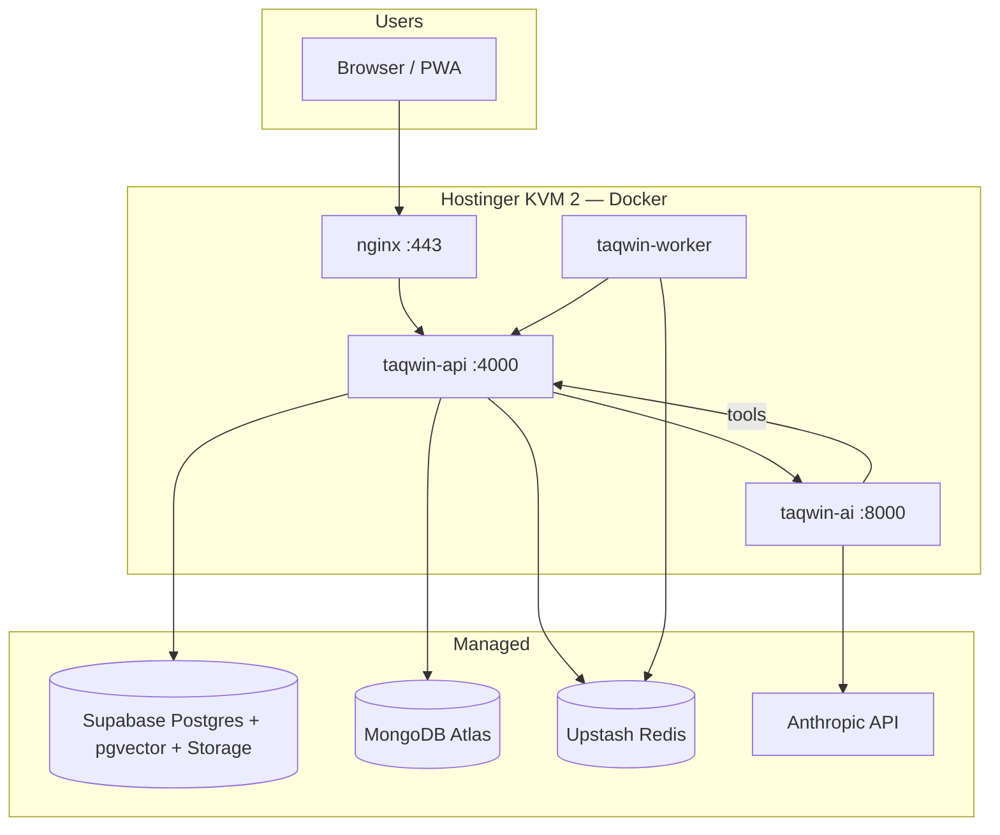
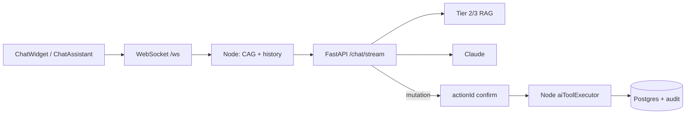

# Taqwin — Master Plan (Product · AI · Production · Profit)

**Last updated:** 2026-06-13  
**Audience:** Founders, developers, graduation defense, investors  
**Purpose:** One document for **what exists**, **what ships next**, and **what a real revenue-ready product still needs**.

This file consolidates: `Taqwin.md`, `docs/AI-PROJECT-STATUS.md`, `AI-COACH-ARCHITECTURE.md`, `backend-node/docs/AI_ARCHITECTURE.md`, `docs/SYSTEM-ARCHITECTURE.md`, `docs/DEPLOY-HOSTINGER.md`, and `DEPLOY.md`.

---

## Table of contents

1. [Executive summary](#1-executive-summary)
2. [Product & users](#2-product--users)
3. [Technology stack](#3-technology-stack)
4. [System architecture](#4-system-architecture)
5. [What is built today](#5-what-is-built-today)
6. [AI Coach system (Blocks A–E)](#6-ai-coach-system-blocks-ae)
7. [Data architecture](#7-data-architecture)
8. [Deployment & infrastructure](#8-deployment--infrastructure)
9. [Security & compliance today](#9-security--compliance-today)
10. [Verify & quality gates](#10-verify--quality-gates)
11. [Roadmap — Phase 0: Launch blockers](#11-roadmap--phase-0-launch-blockers)
12. [Roadmap — Phase 1: Production hardening](#12-roadmap--phase-1-production-hardening)
13. [Roadmap — Phase 2: Monetization & revenue](#13-roadmap--phase-2-monetization--revenue)
14. [Roadmap — Phase 3: Growth & retention](#14-roadmap--phase-3-growth--retention)
15. [Roadmap — Phase 4: Scale & expansion](#15-roadmap--phase-4-scale--expansion)
16. [Technical debt register](#16-technical-debt-register)
17. [Business model options](#17-business-model-options)
18. [KPIs & success metrics](#18-kpis--success-metrics)
19. [Scorecard](#19-scorecard)
20. [Appendix](#20-appendix)

---

## 1. Executive summary

**Taqwin** (تكوين) is an AI-powered fitness platform for **athletes** and **gym owners**: onboarding, personalized workout + diet plans, streaming AI coach, exercise library, nutrition logging, community, marketplace, and gym management.

| Track | Status | Horizon |
|-------|--------|---------|
| **Graduation MVP** | ✅ Code complete (Blocks A–E) | Deploy + demo evidence |
| **Production launch** | ⏳ Docker ready; VPS not live-validated | 2–4 weeks |
| **Revenue-ready product** | ❌ No payments, limited ops, no mobile | 3–9 months |

**Core architectural bet (keep):** Node.js owns execution and Postgres writes; FastAPI owns LLM reasoning, RAG, and plan JSON. Chat streams over WebSocket; mutations require confirmation and audit.

**Biggest gaps for a profit project:** Stripe/subscriptions, production observability, security hardening (httpOnly auth), legal/compliance, AI cost controls, E2E/load testing, gym B2B billing, and removing legacy code paths.

---

## 2. Product & users

### Roles

| Role | Value proposition | Key surfaces |
|------|-------------------|--------------|
| **Athlete** | AI coach + plans + nutrition + community + shop | Dashboard, chat, workouts, nutrition, community, marketplace |
| **Gym owner** | Members, check-ins, analytics | Owner dashboard, member management, gym profile |

> **Removed:** `trainer` role, trainer bookings (`20260608120000_split_profiles_remove_trainer`).

### Athlete journey (happy path)

```text
Sign up → Onboarding questionnaire → Auto plan generation → Dashboard (today workout + diet)
       → Daily logging → Weekly adaptation → AI chat for tweaks → Community + marketplace
```

### Gym owner journey

```text
Sign up (gym role) → Gym profile → Member roster → Check-ins → Owner analytics
```

### Frontend routes (HashRouter)

| Path | Page |
|------|------|
| `/#/` | Landing |
| `/#/auth`, `/#/oauth/callback` | Auth |
| `/#/onboarding/*` | Questionnaires |
| `/#/dashboard` | Role dashboard |
| `/#/ai-assistant` | Full-page coach chat |
| `/#/workouts`, `/#/muscle-wiki`, `/#/nutrition` | Core fitness |
| `/#/marketplace`, `/#/orders` | Commerce |
| `/#/community/*` | Social |
| `/#/owner/*` | Gym owner |

Full route table: `Taqwin.md` § Frontend routes.

---

## 3. Technology stack

| Layer | Technology |
|-------|------------|
| Frontend | React 19, TypeScript, Vite, Tailwind, Framer Motion, Three.js |
| API | Node.js 18+, Express, Prisma |
| AI service | Python 3.11+, FastAPI, LangGraph |
| Primary DB | PostgreSQL (Supabase) — users, plans, catalogs, commerce, RAG pgvector |
| AI datastore | MongoDB Atlas — chat, traces, generation audit |
| Cache & jobs | Upstash Redis — CAG, BullMQ |
| Storage | Supabase Storage (or local disk in dev) |
| Hosting target | Hostinger KVM 2 — Docker: nginx + API + AI + worker |
| LLM | Anthropic Claude (server-side only) |
| Realtime | WebSocket `/ws` — coach streaming, notifications, community presence |

---

## 4. System architecture

### 4.1 Production topology



### 4.2 Golden rules

| # | Rule |
|---|------|
| 1 | **Node owns execution** — all business writes through Express + Prisma |
| 2 | **FastAPI owns reasoning** — LLM, intent, RAG, plan JSON |
| 3 | **FastAPI never writes Postgres** — tools via Node internal API |
| 4 | **Postgres = source of truth** for plans, logs, users, audit |
| 5 | **Mongo = AI warehouse** — chat, traces, verbose generation logs |
| 6 | **Redis = ephemeral** — CAG cache, queues, rate limits |
| 7 | **Browser never holds LLM keys** — FastAPI not public on `:8000` |

### 4.3 AI chat flow (production)



1. SPA opens WebSocket → Node bridges to FastAPI `/chat/stream` (SSE tokens).
2. Node builds **CAG bundle** (profile, plan, logs, targets, behavioral signals) — Redis cache.
3. FastAPI: intent router → hybrid RAG → streaming reply.
4. Mutations: `coach.confirm` / `coach.disambiguate` with `actionId` → tool loop → Postgres `AiToolExecution` → cache invalidation.

### 4.4 Repository layout (summary)

```text
Taqwin/
├── frontend/          React SPA
├── backend-node/      Express API, Prisma, workers, RAG ingest
├── ai-service/        FastAPI coach, RAG, plans, agent
├── deploy/            Docker Compose + nginx
├── shared/            Cross-service JSON contracts
├── docs/              Runbooks + this file
├── AI-COACH-ARCHITECTURE.md
└── Taqwin.md          Feature inventory detail
```

---

## 5. What is built today

### ✅ Shipped — Core platform

| Area | Details |
|------|---------|
| **Auth** | Email/password, Google OAuth, OTP, password reset, 2FA (TOTP), RBAC (`athlete` \| `gym`) |
| **Onboarding** | Multi-flow athlete wizard + gym wizard; dossier on profile |
| **Exercise catalog** | ~1,900+ MuscleWiki exercises, Arabic names, video URLs |
| **Muscle Wiki UI** | 3D muscle picker + exercise panel |
| **Nutrition** | WebTeb catalog, food logging, macro targets |
| **Dashboard** | Calorie history, fitness score, today plan, readiness, life modes |
| **Community v2** | Feed, posts (image/video/voice), stories, DMs, groups, follows, blocks, mentions, reposts, moderation |
| **Marketplace** | Categories, brands, EGP products, cart, orders (no payment gateway) |
| **Gyms** | Profiles, members, check-ins, owner dashboard |
| **Settings** | Account, locale (EN/AR), notifications, 2FA |
| **Support** | Tickets + FAQ |
| **i18n** | EN/AR toggle, RTL helpers |
| **PWA** | Shell + lazy routes |
| **CI** | Backend lint+test, frontend typecheck+build, ai-service pytest |

### ✅ Shipped — AI Coach

| Area | Details |
|------|---------|
| **Chat UI** | `ChatWidget` + `ChatAssistant` share `useCoachChat`; WS streaming only in SPA |
| **RAG** | L1 (17 topics en+ar), L2 exercises, L3 foods, L4 coaching books; Tier 2/3 hybrid + rerank |
| **Plans** | Generate → validate → Postgres → `DailyAthletePlan` → dashboard |
| **Adaptation** | Weekly, mid-week, skip day, swap, life modes, explainability |
| **Agent** | LangGraph coach graph, ~47 chat tools, confirmation flow, agent traces |
| **Memory** | Session + cron summarize → `AiMemory` |
| **Notifications** | Smart workout/meal reminders (D10) |
| **Safety** | Off-topic guard, medical keyword blocks |

### ⏳ Partial / not production-proven

| Area | Gap |
|------|-----|
| **VPS deploy** | Compose exists; live E2E on `taqwin.com` not validated |
| **RAG on prod DB** | Must re-ingest on Supabase after deploy |
| **Exercise video CDN** | Requires `sync:musclewiki-videos` |
| **Deload week (D9)** | Suggestion text only; no dedicated worker |
| **Legacy `coachPlan.js`** | Fallback path alongside Postgres plans |
| **FDC nutrition** | Backend libs exist; UI uses WebTeb |
| **Large assets** | Landing video, 3D GLB may be missing in clone |

### ❌ Not started (profit blockers)

| Area | Impact |
|------|--------|
| **Stripe / payments** | Cannot charge users or process marketplace orders |
| **Subscriptions / tiers** | No free vs premium gating |
| **Mobile app** | Web-only limits retention and push on iOS/Android |
| **Cypress E2E** | No automated user-journey tests |
| **OpenAPI** | No published API contract |
| **Admin panel** | No ops dashboard for users, content, billing |
| **Wearables** | No Apple Health / Google Fit sync |
| **Form-check / food vision** | Differentiator AI features backlog |

---

## 6. AI Coach system (Blocks A–E)

### Block status

| Block | Scope | Status |
|-------|-------|--------|
| **A** Foundation | Schema, Redis, Mongo, FastAPI bridge, CAG, internal tools | ✅ Done |
| **B** RAG + Intent | pgvector L1–L4, Tier 2/3 retrieval, intent router | ✅ Done |
| **C** Plans | Generate, validate, persist, daily slice, dashboard | ✅ Done |
| **D** Smart layer | Mid-week, readiness, skip, life modes, notify, explainability | ✅ Mostly (D9 partial) |
| **E** Agent | LangGraph, tool loop, traces, memory, WS confirm, E2E verify | ✅ Mostly (E9 deploy pending) |

### RAG knowledge layers

| Level | Source | Ingest |
|-------|--------|--------|
| L1 | `data/knowledge/l1/*.md` | `npm run rag:ingest:l1` |
| L2 | Postgres exercises (~1,981) | `rag:ingest:l2` |
| L3 | Foods + WebTeb (~2,243) | `rag:ingest:l3` |
| L4 | Coaching books (`data/coaching-book/`, `data/books/`) | `rag:ingest:l5` |

> **Code note:** Prisma enum and ingest scripts still use `L5_BOOKS` / `rag:ingest:l5`; docs use **L4** for sequential ordering (L1–L4). The old scientific PDF layer was removed — `scientific` intent routes to L4 coaching books.

### RAG retrieval tiers

| Tier | Capability |
|------|------------|
| **1** | Query rewrite, per-level score floors |
| **2** | Hybrid pgvector + full-text RRF, metadata filters, rerank |
| **3** | Retrieval policies, citations, observability dashboard |

### Chat tools (~55 shipped — Phases A–C rollout)

**Phase A (stubs fixed):** `log_water_intake` → `HydrationLog`, `log_workout` / `complete_workout_today` → `WorkoutLog` + daily plan, `log_exercise_set` → structured fields, `submit_plan_feedback`

**Phase B (daily loop):** `complete_workout_today`, `log_meal_from_plan`, `get_workout_week`, `get_body_metric_history`

**Phase C (plan intelligence):** `request_deload_week`, `generate_weekly_workout` / `generate_weekly_diet` re-enabled (step-up), `update_injuries`, `update_equipment`, `adjust_macro_targets`

**Core:** `log_food`, `replace_exercise_today`, `set_life_mode`, `adapt_plan`, `get_nutrition_today`, `get_workout_today`

**Extended examples:** `update_weight`, `record_readiness`, `skip_day`, `swap_meal`, `search_foods`, `search_exercises`, `get_weekly_adherence`, `calculate_tdee_estimate`, `log_meal_from_plan`, `get_body_metric_history`

**Disabled:** `generate_weekly_workout`, `generate_weekly_diet`, `request_booking`, `search_trainers`

Sync check: `npm run verify:tool-registry`

### Defense narrative (one paragraph)

> Taqwin’s AI coach is a **governed pipeline**, not one LLM call. Node assembles athlete truth (CAG) from Postgres, caches in Redis, loads history from Mongo. The SPA streams via WebSocket to FastAPI, which routes intent, runs Tier 2/3 hybrid RAG, and streams a Claude reply. Mutations require `actionId` confirmation, then the tool loop writes Postgres with full audit. Weekly plans are generated separately (FastAPI JSON → Node validator → Postgres → daily slices → adaptation workers). Dashboard and coach always read the same plan via `activePlanService` and `contextBundle`.

Design blueprint detail: `AI-COACH-ARCHITECTURE.md`  
Implementation detail: `backend-node/docs/AI_ARCHITECTURE.md`

---

## 7. Data architecture

| Data | Store | Why |
|------|-------|-----|
| Users, profiles, onboarding | Postgres | ACID, joins |
| Official plans, logs, orders | Postgres | Source of truth |
| RAG chunks + embeddings | Postgres pgvector | Same infra as Supabase |
| Chat threads + messages | Mongo | Append-heavy, flexible |
| Agent traces, LLM audit | Mongo | Verbose nested JSON |
| CAG cache, BullMQ | Redis | Ephemeral, fast |
| Uploads (avatars, community media) | Supabase Storage | CDN, signed URLs |

**Rule:** Mongo never holds official plans. Postgres wins after Node validation.

---

## 8. Deployment & infrastructure

### Target: Hostinger KVM 2 + Docker Compose

| Service | Role |
|---------|------|
| `nginx` | TLS, SPA static, proxy `/api` |
| `taqwin-api` | Express :4000 |
| `taqwin-ai` | FastAPI :8000 (internal only) |
| `taqwin-worker` | BullMQ: plans, adaptation, memory, notify |

**External (not in Docker):** Supabase Postgres, MongoDB Atlas, Upstash Redis, Anthropic API.

### Deploy quick start

Step-by-step for **0.1–0.2**: [deploy/CHECKLIST-0.1-0.2.md](../deploy/CHECKLIST-0.1-0.2.md)

```bash
bash deploy/scripts/dns-check.sh
bash deploy/scripts/deploy-stack.sh    # 0.1
bash deploy/scripts/issue-tls.sh       # 0.2
bash deploy/scripts/verify-production.sh
```

Full runbook: `docs/DEPLOY-HOSTINGER.md`  
Backups: `docs/DATABASE-BACKUPS.md`

### Cron jobs (production)

| Job | Script | Purpose |
|-----|--------|---------|
| Daily plan refresh | `cron-daily-plan-refresh.js` | Slice today’s plan |
| Weekly adaptation | `cron-weekly-adapt.js` | Progress snapshot + adapt |
| Mid-week check | `cron-mid-week.js` | Meso triggers |
| Smart notify | `cron-enqueue-smart-notify.js` | Meal/workout reminders |
| Memory summarize | scheduler in worker | Long-term memory |

---

## 9. Security & compliance today

### ✅ In place

- Helmet, CORS, rate limits (auth + AI routes)
- Zod validation, Prisma parameterized queries
- Supabase signed upload URLs; service key server-only
- Internal API `X-Internal-Key`; nginx denies `/api/internal/*` at edge
- 2FA (TOTP), password policy
- Community text + video moderation hooks
- Sentry init on API + worker (needs DSN configured)

### ❌ Gaps for production profit

| Gap | Risk | Fix |
|-----|------|-----|
| JWT in `localStorage` | XSS → account takeover | httpOnly secure cookies + CSRF |
| No upload virus scan | Malware in community media | ClamAV or cloud scan pipeline |
| No WAF / DDoS layer | Abuse, cost spike | Cloudflare in front of VPS |
| No LLM cost caps per user | Runaway Anthropic bill | Quotas, tier limits, caching |
| No privacy policy / ToS in app | Legal exposure (EG + GDPR) | Legal pages + consent flows |
| No health disclaimer UX | Liability for AI fitness advice | Prominent disclaimers + audit trail |
| No automated security scans | Unknown CVEs | Dependabot + SAST in CI |
| No penetration test | Unknown attack surface | Pre-launch pentest |
| No data export / delete (GDPR) | Compliance failure | Account deletion + export API |
| Secrets in `.env` only | Rotation pain | Secret manager (Doppler/Vault) |

---

## 10. Verify & quality gates

### Graduation / launch gate

```bash
cd backend-node
npm run verify:pre-e:blocks      # Pre-E + RAG + tool-registry + tier3
npm run verify:block-c:all       # Plans pipeline
npm run verify:ws-streaming      # WebSocket chat
npm run verify:e7-integration    # Confirm food + cross-service
npm run verify:tool-registry     # FastAPI ⊆ Node tools
npm run verify:production        # Env checklist

cd ../ai-service && pytest
```

### Manual demo script

1. New athlete → complete onboarding → dashboard shows today workout + diet  
2. Open coach chat (widget or `/ai-assistant`) → ask “what should I eat today?”  
3. Log food via chat → confirm with `actionId` → dashboard macros update  
4. Skip day or set life mode → plan adapts  
5. Community post + story → moderation passes  

### Production profit gate (add later)

- [ ] Cypress E2E: auth → onboarding → dashboard → chat confirm  
- [ ] Load test: 100 concurrent WS chat sessions  
- [ ] RAG eval (RAGAS) gated in CI — threshold ≥ X  
- [ ] Stripe test checkout end-to-end  
- [ ] Uptime monitor (Better Stack / UptimeRobot)  
- [ ] Backup restore drill documented and tested  

---

## 11. Roadmap — Phase 0: Launch blockers

**Goal:** Live product on `taqwin.com` — graduation + first real users.  
**Timeline:** 1–3 weeks

| # | Task | Owner | Done when |
|---|------|-------|-----------|
| 0.1 | Deploy Docker stack on Hostinger KVM 2 | DevOps | `https://api.taqwin.com/health` 200 — [CHECKLIST-0.1-0.2.md](../deploy/CHECKLIST-0.1-0.2.md), `deploy/scripts/deploy-stack.sh` |
| 0.2 | DNS + TLS (Certbot) | DevOps | SPA + API on HTTPS — `deploy/scripts/issue-tls.sh`, `verify-production.sh` |
| 0.3 | Run all migrations on Supabase prod | DevOps | `prisma migrate deploy` clean |
| 0.4 | RAG ingest on production DB | DevOps | `verify:b5` on prod connection |
| 0.5 | Start worker + configure crons | DevOps | Plans generate async; daily refresh runs |
| 0.6 | Full verify suite on prod env | QA | All verify scripts pass |
| 0.7 | Manual 15-scenario matrix | QA | Documented pass/fail log |
| 0.8 | Sentry DSN + error alerts | DevOps | Test error appears in Sentry |
| 0.9 | Graduation demo video | Product | Published link in README |
| 0.10 | Privacy policy + Terms of Service pages | Legal/Product | Linked from auth + settings |
| 0.11 | Health / AI disclaimer in coach UI | Product | Visible before first chat |

---

## 12. Roadmap — Phase 1: Production hardening

**Goal:** Reliable, secure, observable — users can trust the platform daily.  
**Timeline:** 4–8 weeks after launch

### Reliability & ops

| # | Task | Priority |
|---|------|----------|
| 1.1 | Uptime monitoring + PagerDuty/email alerts | P0 |
| 1.2 | Structured logging aggregation (Loki / Datadog / Axiom) | P0 |
| 1.3 | Automated DB backups + tested restore | P0 |
| 1.4 | Redis/Mongo connection retry + circuit breakers | P1 |
| 1.5 | Health checks for ai-service in compose (restart policy) | P1 |
| 1.6 | Staging environment (separate Supabase project) | P1 |
| 1.7 | Blue/green or rolling deploy script | P2 |

### Security

| # | Task | Priority |
|---|------|----------|
| 1.8 | Move JWT to httpOnly cookies + CSRF | P0 |
| 1.9 | Cloudflare WAF + rate limit at edge | P0 |
| 1.10 | Upload virus/malware scan | P1 |
| 1.11 | Dependabot + npm audit in CI (fail on critical) | P1 |
| 1.12 | Account deletion + data export API | P1 |
| 1.13 | Audit log for admin actions | P2 |
| 1.14 | Pre-launch penetration test | P1 |

### AI ops & cost

| # | Task | Priority |
|---|------|----------|
| 1.15 | Per-user daily chat token budget | P0 |
| 1.16 | LLM cost dashboard (Mongo `ai_llm_outputs` → report) | P0 |
| 1.17 | Gate RAG eval in CI (RAGAS golden dataset) | P1 |
| 1.18 | Remove `coachPlan.js` legacy path | P1 |
| 1.19 | D9 full deload week worker | P2 |
| 1.20 | Intent router: reduce regex, more semantic | P2 |

### Quality

| # | Task | Priority |
|---|------|----------|
| 1.21 | Cypress E2E: critical user journeys | P0 |
| 1.22 | OpenAPI spec for public `/api` routes | P1 |
| 1.23 | Load test WS chat (k6 or Artillery) | P1 |
| 1.24 | Remove dead code paths (Mongo plans, trainer routes) | P2 |

---

## 13. Roadmap — Phase 2: Monetization & revenue

**Goal:** Charge money legally and reliably.  
**Timeline:** 2–4 months after hardening

### Revenue streams (prioritized)

| Stream | Model | Implementation |
|--------|-------|----------------|
| **Athlete premium** | Subscription (monthly/yearly) | Stripe Checkout + `Subscription` model |
| **AI coach limits** | Freemium: N chats/day free, unlimited premium | Feature flags + usage counters in Redis |
| **Marketplace** | Product sales + commission | Stripe Payment Intents; order fulfillment workflow |
| **Gym SaaS** | Per-gym monthly fee | Stripe Billing for gym owners; member cap tiers |
| **Supplement affiliates** | Commission on outbound links | Track clicks; partner with MFB/local brands |

### Stripe integration tasks

| # | Task | Notes |
|---|------|-------|
| 2.1 | Stripe account (EG entity or US + Egypt support) | Legal/tax advice required |
| 2.2 | `Subscription`, `Invoice`, `PaymentMethod` Prisma models | Link to `User` / `GymProfile` |
| 2.3 | Checkout for athlete premium | Webhook: `checkout.session.completed` |
| 2.4 | Customer portal (manage subscription) | Stripe Customer Portal |
| 2.5 | Marketplace checkout | Cart → Payment Intent → order status |
| 2.6 | Webhook handler + idempotency | `backend-node/src/routes/stripe.js` |
| 2.7 | Premium feature gates | AI unlimited, advanced analytics, priority support |
| 2.8 | Gym owner billing | Tier by member count |
| 2.9 | Refund + dispute handling | Admin workflow |
| 2.10 | VAT / receipt compliance (Egypt) | E-invoice if required |

### Pricing sketch (validate with market)

| Tier | Price (EGP/mo) | Includes |
|------|----------------|----------|
| **Free** | 0 | Dashboard, basic plan, 5 AI chats/day, community |
| **Pro** | 99–199 | Unlimited AI coach, adaptation, smart notify |
| **Gym Basic** | 499 | Up to 50 members, check-ins, basic analytics |
| **Gym Pro** | 999+ | Unlimited members, branded profile, export |

---

## 14. Roadmap — Phase 3: Growth & retention

**Goal:** Acquire users, keep them active, reduce churn.  
**Timeline:** parallel with Phase 2

| # | Task | Impact |
|---|------|--------|
| 3.1 | Push notifications (web push + email digests) | Retention |
| 3.2 | Referral program (invite code → free Pro week) | Acquisition |
| 3.3 | Onboarding optimization (A/B test flows) | Activation |
| 3.4 | Weekly email report (adherence, streak) | Retention |
| 3.5 | Achievements / streaks / leaderboards (opt-in) | Engagement |
| 3.6 | Arabic RTL polish — full coverage | Egypt market |
| 3.7 | SEO landing pages (workout plans, nutrition AR) | Organic growth |
| 3.8 | Gym partnership program (Alexandria/Cairo pilots) | B2B pipeline |
| 3.9 | In-app NPS + feedback after week 2 | Product insight |
| 3.10 | Analytics (PostHog / Mixpanel) — funnel events | Data-driven growth |
| 3.11 | App Store / Play Store wrapper (Capacitor) | Mobile reach without full native |
| 3.12 | WhatsApp share for community posts / plans | Viral loop (EG market) |

---

## 15. Roadmap — Phase 4: Scale & expansion

**Goal:** Handle 10k+ MAU, new revenue lines, competitive moat.  
**Timeline:** 6–18 months

### Product expansion

| # | Feature | Revenue tie-in |
|---|---------|----------------|
| 4.1 | Native mobile app (React Native) | Subscriptions, push, wearables |
| 4.2 | Form-check AI (camera pose) | Premium differentiator |
| 4.3 | Food vision (photo → log) | Premium + lower friction |
| 4.4 | Wearables sync (Apple Health, Google Fit) | Retention |
| 4.5 | Trainer/coach marketplace (revive role carefully) | Commission |
| 4.6 | Live group classes / video | Gym SaaS upsell |
| 4.7 | White-label for gym chains | Enterprise pricing |
| 4.8 | API for third-party apps | Developer tier |

### Infrastructure scale

| # | Task | Trigger |
|---|------|---------|
| 4.9 | Multi-instance API behind load balancer | >500 concurrent users |
| 4.10 | Separate worker VPS or K8s | Queue backlog > 5 min |
| 4.11 | CDN for exercise videos (Cloudflare R2 / Bunny) | Egress cost / latency |
| 4.12 | Read replica for Postgres analytics | Heavy reporting |
| 4.13 | Dedicated embedding service / batch reindex | RAG latency > 2s |
| 4.14 | Model routing (Haiku for simple, Sonnet for plans) | LLM cost > 20% revenue |
| 4.15 | SOC 2 / ISO path (if enterprise gyms) | B2B contracts |

---

## 16. Technical debt register

| ID | Issue | Severity | Phase to fix |
|----|-------|----------|--------------|
| TD-01 | `coachPlan.js` legacy dashboard path | Medium | 1.18 |
| TD-02 | Regex-heavy action/intent detection | Medium | 1.20 |
| TD-03 | D9 deload week — text only | Low | 1.19 |
| TD-04 | RAG eval not in CI | Medium | 1.17 |
| TD-05 | JWT in localStorage | **High** | 1.8 |
| TD-06 | No Stripe / subscription model | **High** | Phase 2 |
| TD-07 | Marketplace orders without payment | **High** | 2.5 |
| TD-08 | Limited E2E test coverage | Medium | 1.21 |
| TD-09 | SYSTEM-ARCHITECTURE chat diagram shows REST not WS | Low | Doc fix |
| TD-10 | FEATURE_* flag combinatorics | Low | Document + reduce |
| TD-11 | Onboarding may double-trigger plan gen | Low | Audit + idempotency |
| TD-12 | No admin/ops dashboard | Medium | Phase 1 |
| TD-13 | Community at scale — moderation queue | Medium | Phase 1–2 |
| TD-14 | LLM cost visibility | **High** | 1.16 |

**Resolved (June 2026):** dual chat UIs, Node LLM fallback, old scientific PDF layer removed, 8-tool registry, SSE backlog.

---

## 17. Business model options

### Option A — B2C subscription (default path)

Focus on athlete Pro tier. Community + marketplace as retention, not primary revenue.  
**Pros:** Recurring revenue, scalable AI cost per user.  
**Cons:** Needs marketing budget, churn management.

### Option B — B2B gym SaaS

Sell to gym owners; athletes free via gym code.  
**Pros:** Higher ARPU, sales-led growth in Egypt gym market.  
**Cons:** Longer sales cycle, custom requests.

### Option C — Hybrid (recommended)

Free athlete tier + Pro upsell + gym SaaS + marketplace commission.  
**Pros:** Multiple revenue lines, network effects (gyms bring athletes).  
**Cons:** More complex product and support.

### Unit economics to track

```text
LTV = avg subscription months × ARPU − churn cost
CAC = marketing spend / new paid users
LLM cost per MAU = total Anthropic bill / active chat users
Gross margin = revenue − (LLM + hosting + Stripe fees + support)
Target: LTV/CAC > 3, LLM < 15% of ARPU for Pro tier
```

---

## 18. KPIs & success metrics

### Graduation (now)

| Metric | Target |
|--------|--------|
| Verify scripts pass | 100% on prod env |
| Demo video recorded | 1 polished 5–10 min |
| Live deploy | taqwin.com accessible |

### Launch (Phase 0–1)

| Metric | Target (90 days) |
|--------|------------------|
| Registered users | 500+ |
| Weekly active athletes | 100+ |
| Onboarding completion rate | >60% |
| D7 retention | >25% |
| Uptime | >99.5% |
| P0 bugs open | 0 |

### Profit (Phase 2–3)

| Metric | Target (12 months) |
|--------|-------------------|
| Paying subscribers | 200+ |
| MRR (EGP) | 50,000+ |
| Gym SaaS customers | 10+ |
| Marketplace GMV | Track; 5% take rate |
| LLM cost / MRR | <15% |
| Churn (monthly) | <8% |
| NPS | >40 |

---

## 19. Scorecard

| Area | Graduation | Production | Profit-ready |
|------|------------|------------|--------------|
| Product features | A | A- | B+ (needs mobile, payments) |
| AI Coach | A- | A- | B+ (needs cost caps, eval CI) |
| Architecture | A- | A- | A- |
| Security | C+ | B- (after Phase 1) | B+ target |
| Ops / observability | D+ | B- (after Phase 1) | A- target |
| Monetization | F | F | B+ (after Phase 2) |
| Documentation | B+ | A- | A- |

**Overall today:** Strong graduation project, **not yet a profit-ready SaaS**. Phase 0–2 closes the gap.

---

## 20. Appendix

### A. Verify commands (full)

```bash
# backend-node/
npm run verify:pre-e:blocks
npm run verify:block-c:all
npm run verify:ws-streaming
npm run verify:e7-integration
npm run verify:tool-registry
npm run verify:tier2-rag
npm run verify:tier3-rag
npm run verify:production
npm run verify:d10

# ai-service/
pytest
python scripts/verify_b7.py
```

### B. Key environment variables (production)

| Variable | Service | Purpose |
|----------|---------|---------|
| `DATABASE_URL`, `DIRECT_URL` | API | Supabase Postgres |
| `MONGO_URI` | API, AI | Chat + traces |
| `REDIS_URL` | API, worker | CAG + BullMQ |
| `JWT_SECRET` | API | Auth |
| `AI_INTERNAL_KEY` | API + AI | Internal bridge |
| `FEATURE_AI_VIA_FASTAPI` | API | Must be `true` |
| `AI_SERVICE_URL` | API | `http://ai:8000` in Docker |
| `ANTHROPIC_API_KEY` | AI | LLM |
| `OPENAI_API_KEY` / `VOYAGE_API_KEY` | API | Embeddings + rerank |
| `SENTRY_DSN` | API | Error tracking |
| `FRONTEND_URL` | API | CORS |
| `SUPABASE_URL`, `SUPABASE_SERVICE_KEY` | API | Storage |

Full lists: `backend-node/.env.example`, `ai-service/.env.example`, `deploy/.env.production.example`

### C. Document index (detail lives here)

| Document | Use when you need… |
|----------|-------------------|
| **This file** | Full picture: status + all roadmaps |
| [Taqwin.md](../Taqwin.md) | Routes, media paths, API list, conventions |
| [AI-COACH-ARCHITECTURE.md](../AI-COACH-ARCHITECTURE.md) | Block specs, schemas, design rules |
| [backend-node/docs/AI_ARCHITECTURE.md](../backend-node/docs/AI_ARCHITECTURE.md) | Per-block implementation files |
| [docs/AI-PROJECT-STATUS.md](./AI-PROJECT-STATUS.md) | Short AI-only status snapshot |
| [docs/SYSTEM-ARCHITECTURE.md](./SYSTEM-ARCHITECTURE.md) | Production diagrams |
| [docs/DEPLOY-HOSTINGER.md](./DEPLOY-HOSTINGER.md) | Step-by-step VPS deploy |
| [docs/DATABASE-BACKUPS.md](./DATABASE-BACKUPS.md) | Backup procedures |
| [DEPLOY.md](../DEPLOY.md) | Deploy index (Hostinger + legacy) |
| [USER.md](../USER.md) | User/profile API reference |

### D. Immediate next actions (this week)

1. Deploy to Hostinger → validate health + verify suite  
2. Add Privacy Policy + Terms + health disclaimer  
3. Configure Sentry on production  
4. Run manual demo → record graduation video  
5. Start Phase 1 ticket: httpOnly auth + Stripe spike  

---

*End of master plan.*
